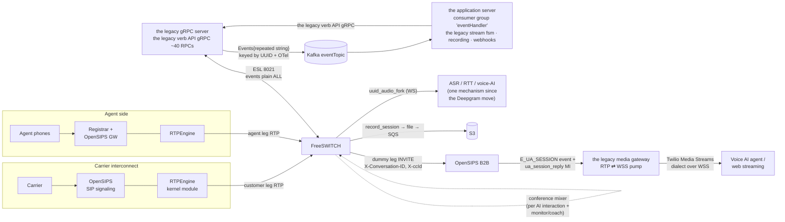
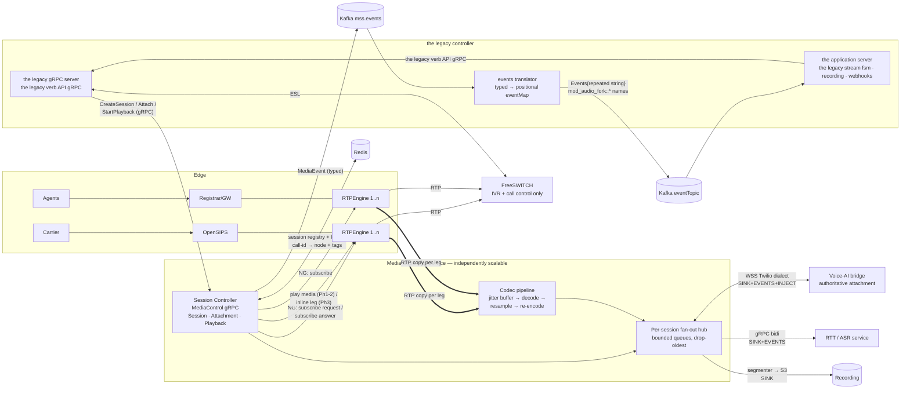
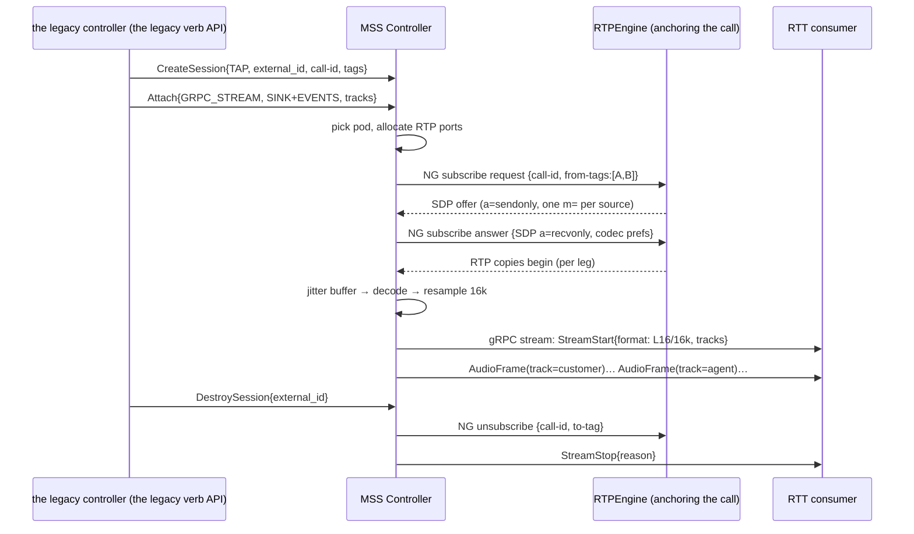
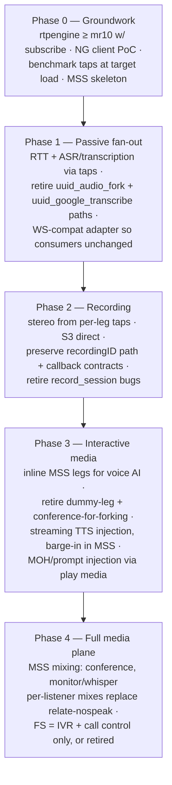

# Centralized Media Server — Architecture Proposal

**Author:** Ashutosh Pandey
**Date:** 2026-08-13 (rev. 2 — language decision locked)
**Status:** Accepted — implementation scaffolded in this repo
**Reader's note:** this is the original internal design record, kept
verbatim as the project's decision history. Component names like `the legacy controller`,
`the legacy media gateway`, `the legacy verb API`, `the voice-AI orchestrator` and `the application server` refer to
the reference deployment this project grew out of — a contact-center
platform whose FreeSWITCH-centric media path MSS replaces. The
[README glossary](../README.md#provenance-and-glossary) maps each name to
its generic role; nothing in the design depends on that specific platform.
**Decision inputs:** Ingest = RTPEngine tap/forwarding · Build = new purpose-built service in **Rust** (single language, single codebase) · Scope = phased (fork/streaming → recording → playback/injection → full media plane)

---

## 1. Executive summary

**Yes — this is feasible, and your stack is unusually well positioned for it.** RTPEngine already touches every RTP packet on both the customer leg and the agent leg, and modern RTPEngine exposes an NG-protocol `subscribe request / subscribe answer / unsubscribe` API that hands a copy of any call participant's media to an external endpoint — with optional transcoding on the subscription leg. That means a new, purpose-built **Media Streaming Service (MSS)** can pull per-call audio taps directly from RTPEngine and fan them out to RTT (gRPC stream), ASR (WebSocket), and voice-AI consumers — **without FreeSWITCH creating a single media bug, dummy leg, or conference for forking.**

Today, every fork-shaped feature routes through FreeSWITCH and costs FS resources per call:

| Feature today | FS mechanism | FS cost per call |
| --- | --- | --- |
| Real-time transcription / RTT | `uuid_audio_fork` (forked mod_audio_fork) | 1 media bug + 1 WS connection + L16 encode |
| Speech gather / ASR | `uuid_audio_fork` → Deepgram (was `uuid_google_transcribe2`) | 1 media bug + 1 WS connection |
| Voice AI agent | dummy leg via `originate … &conference(...)` → OpenSIPS B2B → the legacy media gateway | 1 extra SIP leg + **1 full conference mixer** + 1 conference member |
| Recording | `record_session` media bug (`RECORD_STEREO`) | 1–2 media bugs + local file I/O |
| Monitor/whisper | conference member + `relate … nospeak` | 1 leg + mixer work per supervisor |
| Media-to-web streaming | the legacy media gateway leg in the same conference | conference mixing overhead |

The target end-state removes all of the passive-listening load from FS in Phase 1–2, moves audio injection (bot speech, prompts into live calls) in Phase 3, and leaves a roadmap where mixing/conferencing itself moves to the MSS in Phase 4 — at which point FreeSWITCH is reduced to IVR + call-control, or replaced.

Two hard truths this document designs around:

1. **A tap is listen-only.** RTPEngine subscriptions give you a one-way copy of media. Passive consumers (RTT, ASR, transcription, recording, analytics, supervisor listen) are perfectly served. Interactive consumers (a voice-AI agent that *talks back*) need an injection path. Phase 3 handles this by making the MSS an *inline* RTP endpoint for interactive sessions (the same B2B INVITE pattern the legacy media gateway uses today, minus the conference), while keeping the tap for everything passive. RTPEngine's `play media` exists but is file/blob-oriented (ffmpeg-decodable inputs), not a streaming TTS pipe — suitable for prompts/MOH, not for live bot speech.
2. **the legacy media gateway is a seed, not a foundation.** It proves the concept (Go process terminates RTP, negotiates SDP, bridges to a bot over WSS) but a code audit shows it is a single-consumer, single-codec-family, no-jitter-buffer pump with hardcoded 20 ms pacing and per-pod pinned state. Section 7 catalogs exactly what a purpose-built MSS must do differently — that list is effectively the requirements delta.

---

## 2. Current state (as built, from code)



Key structural facts pulled from the two repos:

- **the legacy controller is seven binaries, not one.** `the legacy gRPC server` owns the ESL socket and exposes `the legacy verb API.proto` over gRPC; `the application server` consumes events from Kafka; `the parser server`, `the executor server`, `the resource server`, `the voice server`, `the application worker` sit around them. The media surface is already service-oriented — which is why MSS can slot in behind a tenant flag.
- **the legacy gRPC server → FS is a single long-lived inbound ESL socket** (`eventsocket.Dial`, singleton via `sync.Once`), subscribed with `events plain ALL`, and the event fan-out **drops events when the subscriber channel is full**. Every media feature adds event volume to this one pipe.
- **Events leave the legacy gRPC server on Kafka.** `pkg/the legacy verb API/eventproducer` marshals each eventMap into `Events{repeated string}`, keys the message by call UUID and injects OTel context; `the application server` reads it as consumer group `eventHandler`. Per-call ordering, replay and multi-consumer fan-out are therefore already solved by the bus — the reason MSS publishes events rather than streaming them (§5.4).
- **ASR moved from Google to Deepgram, and became the fork.** `PlayAndDetectSpeechWithGSR` now calls `initiateStream(...)` instead of `uuid_google_transcribe2` (the old call is commented out in `fs_api.go`). RTT, gather-ASR and the voice-AI fork are one mechanism, and the module now emits `mod_audio_fork::{start_of_transcript, partial_speech_result, end_of_utterance, first_transcript}` — a continuous interim-results stream, not one event per finished utterance.
- **`mod_audio_fork` is a translator, not a pipe.** `FsEventSink::Emit` converts each WebSocket message from the far end into an FS CUSTOM event (`mod_audio_fork::<name>`, `Unique-ID` + `Fork-ID` headers, JSON in the body). Consumers never touch Kafka — the contract MSS must preserve (§5.5).
- **The voice-AI path is a Rube Goldberg of media hops:** the legacy controller `CreateParticipant` runs `bgapi originate {…, origination_uuid, absolute_codec_string, sip_h_X-Conversation-ID…}<dest> &conference('<name>'@default++flags{…})` — i.e., FS dials a *dummy leg* toward OpenSIPS B2B purely so that the conference's mixed audio flows to the legacy media gateway, which answers via `ua_session_reply` and pumps RTP→WSS to the bot. One AI interaction = 1 conference mixer + 1 extra leg + 1 RTP termination, all for what is conceptually "copy this call's audio to a websocket."
- **Forking is FS-resident:** `bgapi uuid_audio_fork <uuid> start <wsURL> <mixType> <samplingRate> <streamSid> <accID> <callSid> <track> <metadataJSON>` (your forked mod_audio_fork with 4 custom positional args) and `uuid_google_transcribe2 … start` each attach a media bug to the channel. `the legacy stream fsm` then choreographs `pause/resume/send_text` around FS `playback`/`break` timing.
- **Recording is FS-resident:** `record_session` media bugs writing to a shared filesystem, with recording identity encoded in the file path (`${accountID}/${recordingID}.${fileFormat}`), uploaded via SQS jobs, callbacks driven by FS RECORD_START/STOP events.
- **Monitor/whisper is conference-resident:** supervisor joins the conference muted, then `bgapi conference '<name>' relate <datumIds> <relatedIds> nospeak` isolates who hears whom; coach = unmute while nospeak-related to the customer.
- **the legacy media gateway is per-call pinned:** symmetric-RTP latching (client address learned from first inbound packet), one UDP port per call from a 35000–65000 pool, ~7 goroutines per call, all session state in-process; Redis only for bookkeeping. No jitter buffer, no RTCP, no SRTP, transcoding limited to µ-law↔A-law, Opus is passthrough-only, and the playout pacer is a hardcoded 20 ms ticker regardless of negotiated ptime.

### Why FreeSWITCH is the bottleneck

Every one of the six features in the table above executes inside the FS media thread pool of the *same box that is also doing IVR playback, bridging, and DTMF*. Media bugs run synchronously in the channel's media path; conferences run a mixer loop per conference; `uuid_audio_fork` does L16 conversion + WS I/O inside FS. Scaling FS means scaling *all of it together*, vertically or by adding whole FS nodes — and the legacy controller's single ESL socket with `events plain ALL` scales event volume with call volume, in one TCP stream, with silent drops as backpressure. The load that is growing fastest (AI/ASR/RTT fan-out) is precisely the load that has no architectural reason to be on FS at all.

---

## 3. Target architecture



Three properties this diagram is drawn to make explicit, each argued in §5:

- **Commands flow one way over gRPC; events flow the other way over Kafka.**
  MSS never streams events to the legacy controller in the production path.
- **Consumers never touch Kafka.** They speak their attachment's transport;
  MSS is the sole producer of a session's events.
- **Exactly one attachment is authoritative** — only its events become the
  legacy `mod_audio_fork::*` names that drive `the legacy stream fsm`.

### 3.1 Components

**Session Controller** — the control plane. Exposes the `MediaControl` gRPC API over the Session / Attachment / Playback nouns defined in §5.1 (a `TelCompat` façade translates the legacy controller's the legacy verb API verbs, §5.6). It owns the RTPEngine interaction: for each tap it sends `subscribe request {call-id, from-tag | from-tags, …}` to the RTPEngine instance anchoring that call, receives rtpengine's `a=sendonly` SDP offer, allocates a local RTP port, and replies with `subscribe answer` (`a=recvonly`) — optionally requesting a codec on the subscription leg so rtpengine transcodes at the tap (e.g., ask for PCMU even if the leg is Opus). Teardown is `unsubscribe`. This is the same mechanism SIPREC recording servers use with rtpengine, so it is a stable, supported surface.

**Ingest / codec pipeline** — per subscribed stream: UDP socket → RTP depacketization → **jitter buffer** (sequence reorder, loss detection, PLC — G.711 Appendix I for G.711, libopus's own for Opus) → decode to linear PCM → resample (8 kHz ↔ 16 kHz ↔ 48 kHz) → per-consumer re-encode (L16/16k for ASR, PCMU/8k for Twilio-dialect consumers, Opus for bandwidth-sensitive consumers). One decode per stream, N encodes shared across consumers wanting the same format.

**Fan-out hub** — per session, an in-process pub/sub: one ingest (or two, customer + agent leg), N subscribers. Subscribers attach/detach mid-call. Each subscriber has an independent queue with drop-oldest backpressure and per-subscriber metrics, so one slow ASR endpoint can't stall the RTT stream (a failure mode the legacy media gateway has today — its mark-echo write blocks the RTP pacer).

**Consumer adapters:**

- *gRPC bidirectional stream* — the new native interface (frame contract in §5.8). Server-side streaming of audio frames + events; client → server messages carry control (marks/clear) and, where the attachment declares `INJECT`, audio.
- *WebSocket, Twilio Media Streams dialect* — wire-compatible with what the legacy media gateway sends today (`start/media/dtmf/stop/mark` out, `media/mark/clear/endOfInteraction` in), so existing bot/ASR endpoints migrate with zero changes.
- *Recording sink* — PCM → stereo WAV/OGG segmenter honoring the existing `${accountID}/${recordingID}.${fileFormat}` identity contract, uploading directly to S3 (no shared filesystem, no SQS hop — or keep SQS initially for compatibility).

**State & events** — session registry in Redis (which pod owns which session, attachment list, status) with CAS-safe updates and ownership leases. Media events go to Kafka `mss.events` as typed `MediaEvent`, translated into the legacy `eventTopic` format by a shim in the legacy controller (§5.4); billing/lifecycle events reuse `LEGACY_MEDIA_GATEWAY_BILLING_TOPIC` / `KAFKA_VOICE_AI_AGENT_TOPIC` schemas so downstream consumers don't change.

### 3.2 Why tap-based ingest scales better than everything you do today

- **Pull, not push.** The MSS *initiates* the subscription toward rtpengine. Session placement is a scheduling decision made by your control plane (any pod with capacity takes the session), not a consequence of SDP routing. This kills the hardest scaling problem the legacy media gateway has — OpenSIPS must route the B2B INVITE to a specific pod whose `RTP_IP` is routable — and replaces it with "pod X asks rtpengine to send to pod X's address."
- **No FS involvement at all** for passive consumers. No media bug, no dummy leg, no conference, no ESL traffic. FS capacity planning decouples from AI/ASR adoption.
- **RTPEngine does the copy where the packets already are.** The kernel module keeps forwarding the primary media path; the subscription adds one userspace copy per tap on the rtpengine host. This is the same work rtpengine does for SIPREC deployments at scale. (Benchmark note: subscription legs are handled in userspace, so budget rtpengine CPU headroom — see §9 risks.)
- **N consumers, one tap.** Today three consumers of the same call's audio = three separate FS mechanisms (audio_fork WS + transcribe bug + conference leg). In the MSS it's one subscription, one decode, three subscribers on the hub.

---

## 4. Ingest deep dive: the RTPEngine tap

Sequence for a Phase-1 tap (e.g., the legacy controller wants RTT on a live call):



Design details:

- **Leg selection.** `subscribe request` takes `from-tag` / `from-tags` to choose which participant(s) to copy; the `mix` flag can ask rtpengine to combine sources into one output stream if a mixed mono feed is wanted (cheap supervisor-listen). Prefer *separate* per-leg subscriptions for ASR/recording — you keep speaker separation for free (today `RECORD_STEREO` does this inside FS).
- **Which rtpengine to talk to.** The tap must go to the rtpengine instance anchoring the call. OpenSIPS already knows this (it picked the instance via the rtpengine/rtp_relay module). **Decided:** OpenSIPS publishes call-id → rtpengine node + tags to Redis at call setup, and MSS resolves `external_id` through that map (§5.1); passing the node inline in `CreateSession` remains a fallback for callers that already know it. Direct NG from MSS→rtpengine keeps OpenSIPS out of the media-copy control path entirely.
- **Transcoding at the tap.** Ask for PCMU/PCMA (or even L16 where supported) in the `subscribe answer`; rtpengine transcodes the subscription leg if the call codec differs. Still implement decode/resample in the MSS — you don't want rtpengine spending CPU transcoding when the MSS can, and you need 16 kHz L16 for most ASR anyway, which is best produced from your own resampler.
- **Two taps per interaction** (customer leg at the interconnect rtpengine, agent leg at the agent-side rtpengine) when both sides are needed; one tap when only the customer side matters (voice-AI pre-agent, IVR-stage ASR — where there is no agent leg yet).
- **DTMF.** RFC 2833 telephone-events arrive in the tapped RTP; the pipeline surfaces them as DTMF events on the hub (the legacy media gateway's `DecodeDTMF` logic — end-bit + (digit, timestamp) dedupe — is directly reusable).

---

## 5. The MSS interface

Verified against the legacy controller `development` (2026-08-16). Three facts reshape this
section from what an earlier draft assumed:

- **the legacy controller is service-oriented already.** `cmd/the legacy gRPC server` exposes
  `pkg/the legacy verb API/proto/the legacy verb API.proto` (~40 RPCs) over gRPC; `cmd/the application server`
  is a separate process.
- **Events travel on Kafka, not ESL, once they leave the legacy gRPC server.**
  `pkg/the legacy verb API/eventproducer` subscribes to the ESL stream and publishes
  every event to a Kafka topic as `Events{repeated string events}` — the
  positional eventMap indexed by `constants.MapKeyIndex` — keyed by call
  UUID, with OpenTelemetry context injected. `the application server` consumes it as a
  consumer group (`sarama.NewConsumerGroup(..., "eventHandler")`).
- **ASR is no longer a separate mechanism.** Commit *"moved asr from google
  to deepgram"* rewired `PlayAndDetectSpeechWithGSR` from
  `uuid_google_transcribe2` to `initiateStream(...)` — the audio fork. RTT,
  gather-ASR and the voice-AI fork are now **one mechanism** with different
  far ends, and the speech vocabulary grew accordingly:
  `mod_audio_fork::{start_of_transcript, partial_speech_result,
  end_of_utterance, first_transcript, end_of_interaction, play_audio}`.

### 5.1 Design rule: nouns, not FreeSWITCH verbs

MSS does **not** mirror `the legacy verb API.proto`. Those names — `StreamPause`,
`StreamSendText`, `StartCallTranscription` — describe *how FreeSWITCH does
it*, and Phase 3/4 (inline legs, mixing, whisper) do not fit that
vocabulary. MSS exposes a small noun-oriented API, and a thin compatibility
façade speaks the legacy controller's verbs until the legacy controller no longer needs them.

Four nouns carry every phase:

| Noun | What it is | Kinds |
| --- | --- | --- |
| **Session** | a media context MSS owns | `TAP` (Phase 1-2) · `INLINE` (Phase 3) · `MIX` (Phase 4) |
| **Attachment** | anything bound to a session that consumes or produces audio | transport × direction × selector × format |
| **Playback** | audio put into a session, targeted at a participant | blob · file · stream (Phase 3) |
| **Event** | one typed stream out | see 5.4 |

```proto
service MediaControl {
  rpc CreateSession(CreateSessionRequest) returns (Session);
  rpc DestroySession(SessionRef) returns (Ack);
  rpc DescribeSession(SessionRef) returns (Session);

  rpc Attach(AttachRequest) returns (Attachment);              // consumer, recorder, RTT, agent
  rpc Detach(AttachmentRef) returns (Ack);
  rpc UpdateAttachment(UpdateAttachmentRequest) returns (Attachment);  // pause/resume/select/format
  rpc SendToAttachment(SendToAttachmentRequest) returns (Ack);         // send_text parity

  rpc StartPlayback(StartPlaybackRequest) returns (Playback);
  rpc StopPlayback(PlaybackRef) returns (Ack);                 // barge-in primitive

  rpc WatchEvents(WatchRequest) returns (stream MediaEvent);   // debug/direct consumers, not the prod path
}
```

Note the absences: no Pause/Resume RPCs (that is
`UpdateAttachment{paused}`), no recording API (an attachment with an S3
sink), no transcription API (an attachment with an ASR sink). Fewer verbs,
more nouns, is what buys the future phases.

**Dual addressing is mandatory.** the legacy controller keys everything by channel UUID
because FreeSWITCH owns the channel; MSS keys by (call-id, from-tags,
rtpengine node) because rtpengine does. Every request carries
`external_id` (the legacy controller's `request_uuid`), and MSS resolves it through the
OpenSIPS → Redis map — the discovery item still open in M2 and now on the
critical path for all of this.

Every mutating RPC takes an idempotency key: a retry during pod loss must
not double-attach or double-record.

### 5.2 Attachments: capability is declared, not assumed

Fan-out means N consumers of one call, and they are not alike:

| Attachment | Audio out | Back-channel | Capability |
| --- | --- | --- | --- |
| Recorder (S3/file) | yes | none | `SINK` |
| RTT | yes | text → events | `SINK + EVENTS` |
| ASR / gather | yes | text → events | `SINK + EVENTS` |
| Voice-AI bridge | yes | text + audio | `SINK + EVENTS + INJECT` |
| Analytics / QA | yes | none | `SINK` |

The declaration is an **authorization boundary**, not bookkeeping: a
recorder must not be able to push audio into a live call, and an analytics
sink must not be able to emit `end_of_interaction` and tear a session down.
Declaring capability at attach makes those structurally impossible instead
of politely avoided. The Phase-0 spike already does this in embryo — the
voice-AI consumer is built with a command channel, listeners with `None`,
so only the bridge can inject.

Transport is orthogonal to direction: WS-Twilio (frozen, what consumers
speak today), gRPC bidi (better for new consumers), file/S3 (no
back-channel at all).

### 5.3 One authoritative attachment per session

Fan-out creates a problem the legacy design never had. There was exactly
**one** fork per call, so "the fork's events" *were* "the call's events" —
identity came free. With N consumers it does not: if an RTT service and a
voice-AI bridge both return `first_transcript`, `the legacy stream fsm` sees two, and a
state machine driven twice corrupts the call silently.

So: every event carries `attachment_id`, and exactly **one attachment per
session is marked authoritative**. Only its events are rendered into the
legacy `mod_audio_fork::*` names that drive `the legacy stream fsm`. Others still reach
`mss.events` (analytics, debugging, future consumers) but never the FSM.
A second authoritative attach is rejected, not silently resolved.

Authoritative follows the session's purpose, not a fixed consumer type: in
a voice-AI session the bridge is authoritative; in a gather session the ASR
attachment is, because its `first_transcript`/`end_of_utterance` are what
the FSM's timers run on. The `TelCompat` façade sets it from the verb that
created the session.

### 5.4 Commands over gRPC, events over Kafka

Events must **not** stream back over gRPC. the legacy controller's consumption is a Kafka
consumer group, which already solves durably what a gRPC event stream would
reintroduce badly: fan-out to multiple the application server instances, per-call
ordering (key = UUID), consumer restart without loss, backpressure, replay.

```
the legacy controller ──gRPC MediaControl──▶ MSS
MSS ──Kafka "mss.events"──▶ translator ──Kafka "eventTopic"──▶ the application server (unchanged)
                            (small Go shim, lives in the legacy controller)
```

- **`mss.events`** — MSS's own topic, typed protobuf `MediaEvent`, keyed by
  `external_id`, sequence-numbered per session, OTel context injected. This
  is MSS's long-term contract and the only format MSS knows.
- **`eventTopic`** — the existing legacy topic, untouched. A thin Go
  translator renders the positional `Events{repeated string}` that
  `the application server` already parses.

**The translator lives in the legacy controller, not MSS.** The legacy format *is*
`constants.MapKeyIndex` — a positional index table defined in Go — plus
vendor-specific event names. Encoding that into Rust would couple MSS to a
Go constant file that changes without our knowing; the day someone inserts
an index, MSS silently corrupts every event. Keeping the shim beside its
definitions also means it is ~200 lines you *delete* when the legacy controller's consumers
move to typed events, rather than a permanent seam in the media plane.

```proto
message MediaEvent {
  string session_id = 1; string external_id = 2; string attachment_id = 3;
  uint64 seq = 4; google.protobuf.Timestamp at = 5;
  oneof payload {
    SpeechStarted speech_started = 10;
    PartialTranscript partial = 11;          // highest-rate event in the system
    FinalTranscript final = 12;
    EndOfUtterance end_of_utterance = 13;
    Dtmf dtmf = 14;
    PlaybackStarted playback_started = 15;
    PlaybackStopped playback_stopped = 16;
    RecordingStarted recording_started = 17;
    RecordingStopped recording_stopped = 18;
    UploadCompleted upload_completed = 19;
    AttachmentUp attachment_up = 20;
    AttachmentDown attachment_down = 21;
    SessionEnded session_ended = 22;
  }
}
```

### 5.5 A consumer never writes to Kafka

`mod_audio_fork` is a **translator, not a pipe**: `FsEventSink::Emit` turns
a message the far end sent on the WebSocket into a FreeSWITCH CUSTOM event
with subclass `mod_audio_fork::<name>`, stamps `Unique-ID` and `Fork-ID`,
carries the JSON in the event body, and hands it to FS — from where
the legacy gRPC server lifts it to Kafka. **The bridge has never known Kafka exists.**

MSS occupies exactly that position, and the rule generalises:

> **Media-plane components own event identity.** A consumer speaks only its
> attachment's transport. MSS is the sole producer of a session's events,
> because only MSS knows the session, its `external_id`, and its sequence.

Letting consumers write to Kafka directly would break this in five ways:
they do not reliably know the UUID that keys ordering; two producers per
call race on a state machine that depends on event order; every vendor
integration would need broker credentials, the positional format and OTel
conventions; there would be no validation point for hostile input (Article
IV); and the same bridge could no longer run behind the legacy media gateway, FS, and
MSS unchanged.

The consequence is deliberate: MSS is a single writer per session and
therefore sits on the barge-in critical path. Nothing can route around it
to go faster, which makes the `partial_speech_result` → `StopPlayback`
cut-through a **Phase-1 measurement**, not a Phase-3 nicety.

### 5.6 Compatibility façade: the legacy verb API verbs onto MSS nouns

A `TelCompat` service reuses `the legacy verb API.proto`'s message shapes verbatim, so a
tenant flag routes calls to `the legacy gRPC server` or `MSS` with **no client
change** and rollback is a config flip.

| the legacy verb API RPC today (→ FS) | MSS nouns |
| --- | --- |
| `StartStream(ws_url, track, stream_sid…)` | `CreateSession{TAP}` + `Attach{WS_TWILIO, SINK+EVENTS+INJECT}` |
| `StopStream` | `Detach` (+ `DestroySession` if last) |
| `StreamPause` / `StreamResume` | `UpdateAttachment{paused}` |
| `StreamSendText` | `SendToAttachment` |
| `StreamPlayFile` | `StartPlayback{file}` |
| `StartCallTranscription` (now the fork) | same as `StartStream` — one mechanism since the Deepgram move |
| `StartRecording(acc_id, record_id, format, channels)` | `Attach{FILE_S3, SINK}` |
| `StopRecording` | `Detach` |

`the legacy stream fsm` carries over unchanged: it keeps driving FS `playback`/`break`
for prompts while pausing/resuming the *MSS attachment* instead of the FS
media bug. `PlayBackStopEvent` still originates from FS in Phases 1-2, so
the "stop playback → wait → resume fork" sequencing is unaffected.

### 5.7 The same nouns carry Phase 3 and 4

The test of whether the abstraction is real is that later phases add no
RPCs:

- **Phase 3 inline leg** — `CreateSession{INLINE}`; the voice agent becomes
  `Attach{DUPLEX}`, the same attachment with direction flipped; streaming
  TTS is `StartPlayback{stream}`.
- **Phase 4 conference** — `CreateSession{MIX}`; each participant is
  `Attach{RTP_INLINE, DUPLEX}`; **monitor** is `Attach{SINK}` on a mixed
  selector with *no SIP leg at all*; **whisper** is
  `StartPlayback{target: member_id}`; **barge** is
  `UpdateAttachment{selector}`. The mix matrix is attachment config.
- **A new consumer type** (different ASR vendor, analytics sink) is a new
  transport enum value plus a config blob. No API change.

### 5.8 Data plane: the frame contract

Control (§5.1) says who may attach and with what capability; this is what
actually flows on a gRPC attachment (`proto/mediastream.proto`):

```proto
service MediaStream {
  rpc Subscribe(stream ConsumerToServer) returns (stream ServerToConsumer);
}
message ServerToConsumer {
  oneof msg {
    StreamStart start = 1;   // session ids, tracks, AudioFormat{encoding, sample_rate_hz, channels, ptime_ms}
    AudioFrame frame = 2;    // track, seq, pts_ms, payload (raw, NOT base64)
    DtmfEvent dtmf = 3;
    TextEvent text = 4;      // send_text passthrough
    StreamStop stop = 5;
  }
}
message ConsumerToServer {
  oneof msg {
    ConsumerHello hello = 1; // auth, requested format (MSS re-encodes per consumer)
    AudioFrame inject = 2;   // only honored when the attachment declared INJECT
    Mark mark = 3;
    Clear clear = 4;
  }
}
```

Binary frames over HTTP/2 remove the per-packet JSON+base64 overhead the
WS dialect carries (50 marshals+encodes/sec/call; at 1,000 calls that is
50k/sec of pure serialization). The WS-Twilio adapter keeps that cost
deliberately — it is the compatibility surface, not the native one.

---

## 6. Audio injection (Phase 3) — where the tap isn't enough

A subscription is one-way by design. Three injection options, and the recommendation:

1. **Inline MSS leg (recommended for interactive AI).** For sessions where the consumer talks back, the MSS is placed *in the media path* as an RTP endpoint — exactly what the legacy media gateway does today, but bridged directly instead of via a conference: the legacy controller bridges the customer channel to the MSS leg (`bridge` to an OpenSIPS B2B destination carrying `X-Conversation-ID`/`X-ccId`, answered by the MSS via `ua_session_reply`), or OpenSIPS routes the leg to the MSS before FS is involved at all (pre-IVR AI agents — FS fully bypassed). Full duplex: caller audio out to the bot, bot audio (streaming TTS) back in, barge-in handled in the MSS (stop playout on caller speech). This replaces the dummy-leg + conference construct with a plain two-party bridge.
2. **`play media` via rtpengine NG** — good for *file-shaped* injection (prompts, MOH, comfort messages) into tapped calls: `play media {call-id, from-tag|all, file|blob, repeat-times, codec-set, block egress}`; anything ffmpeg decodes. Not suitable for continuous streaming TTS, but a cheap win for "MSS-driven MOH" (killing the `file_string://moh!moh!…!silence_stream://-1` hack) and filler audio. **Measured against 14.1.1.8** (`lab/ng_inject_probe.py`): audio reaches the call, `from-tag` selects the single participant who hears it (whisper-shaped targeting), `all: "all"` reaches both, and `blob64` is rejected — the blob must be raw bytes.
3. **rtpengine `publish`** — ~~injects a new media source into a call without offer/answer~~ **disproven for 14.1.1.8** (`lab/ng_inject_probe.py`): rtpengine accepts `publish`, answers with a `recvonly` SDP and happily receives RTP on the offered port, but that media never reaches the call's participants. It is a broadcast source for `subscribe`-ers, not an injector into an existing call's media matrix. Injection into a live call is therefore `play media` (utterance-shaped) or an inline leg (streaming), with nothing in between.

Rule of thumb for the end-state: **taps for ears, inline legs for mouths.** Passive consumers stay on subscriptions; each interactive session gets one inline MSS leg; both feed the same fan-out hub so an interactive AI session can *also* serve RTT/recording subscribers from the same pipeline.

---

## 7. Lessons from the legacy media gateway: the build checklist

### 7.1 Requirements delta from the the legacy media gateway audit

The audit of `the legacy media gateway` produced a concrete list of what the purpose-built service must do differently. Treat this as hard requirements:

| # | the legacy media gateway today | MSS requirement |
| --- | --- | --- |
| 1 | No jitter buffer; packets forwarded in arrival order; seq/timestamp ignored | Proper jitter buffer per ingest stream: reorder, dedupe, loss detection, bounded delay (start ~40–60 ms adaptive), PLC for G.711 |
| 2 | Hardcoded 20 ms ticker regardless of negotiated ptime; drift never corrected | Pacing derived from negotiated ptime; wall-clock-anchored scheduler (send when `t0 + n·ptime` passes), not a naive ticker |
| 3 | Mark-echo WS write inline on the pacing goroutine (2 s timeout) can stall audio | Strict isolation: pacing loop never does network I/O with unbounded/blocking semantics; all consumer I/O behind per-consumer queues |
| 4 | Single consumer per session, hard-wired | Fan-out hub, N consumers, attach/detach mid-call, per-consumer format + backpressure |
| 5 | Transcode = µ-law↔A-law only; no resampling; Opus passthrough; codec mismatch silently passes garbage | Full pipeline: G.711/G.722/Opus decode+encode, 8k/16k/48k resample, L16 output; reject-or-transcode, never pass mismatched bytes |
| 6 | Port pool O(N)-under-mutex, one port per call, no RTCP | Free-list/bitmap allocator O(1); RTCP optional but socket pair reserved; `SO_REUSEPORT` + `recvmmsg` batching instead of per-call read goroutine spin loops (50 syscalls/sec/call today) |
| 7 | Redis session JSON read-modify-write, no CAS → lost updates | Versioned writes (WATCH/Lua or per-field hashes) |
| 8 | Per-datagram goroutine for OpenSIPS events → INVITE/BYE races per b2b key | Per-session serialized event queues (the legacy controller's the legacy stream fsm sharding pattern is the right one) |
| 9 | `ptime=0` parse path → integer divide-by-zero panic; answers Opus with no rtpmap; strips telephone-event from answers | Hardened SDP handling (or lean on rtpengine to normalize — subscription SDP comes from rtpengine, which is well-formed) |
| 10 | Pod-crash "recovery" is billing bookkeeping only; orphaned legs never torn down | Session registry with ownership leases; on pod death, controller re-establishes taps on a healthy pod (subscriptions are re-creatable — a *huge* HA advantage over inline legs) and tears down orphaned rtpengine subscriptions |
| 11 | JSON + base64 per 20 ms frame per consumer | Binary gRPC frames natively; base64/JSON only on the WS-compat adapter |
| 12 | No SRTP/DTLS/ICE | Fine to keep out of MSS: rtpengine terminates crypto at the edge; subscription legs are plaintext RTP on the private network. Revisit only if taps cross trust boundaries |

### 7.2 Language decision: Rust

**Decision (2026-08-13): Rust, single service, single codebase.** Rationale: deterministic latency is a hard requirement (no GC in the media path, by construction rather than by tuning); the Phase-4 end-state — a full media plane with per-listener conference mixing — is exactly the workload where no-runtime, cache-friendly code pays off; and this service is a decade-horizon strategic asset, which is the amortization window where Rust's upfront cost is recovered. Go was evaluated and is technically viable for Phases 1–2 (sub-ms GC pauses vs a 20 ms frame budget), but was ruled out against the latency-determinism requirement and the Phase-4 mixer.

**The two-world architecture (non-negotiable):**

- **Control world — Tokio.** Session API (tonic gRPC + REST), RTPEngine NG client, Redis session registry, Kafka producers, consumer WebSocket/gRPC I/O. Async is the right tool here; nothing in this world touches a packet deadline.
- **Media world — dedicated OS threads.** One worker thread per core (pinned), each owning its sessions end-to-end: UDP sockets (`recvmmsg` batched), jitter buffers, codec state, fan-out queues, playout pacing. Wall-clock-anchored deadlines (`t0 + n·ptime`, never naive tickers), zero heap allocation per packet, no locks on the packet path — sessions are pinned to one worker so there is no cross-thread packet handoff.
- The worlds communicate over bounded lock-free queues; the media world never blocks on the control world.

**Sans-IO cores.** All protocol and DSP logic (RTP, jitter, G.711, DTMF, NG bencode, consumer dialects) is written as pure state machines with time as an explicit parameter — no sockets, no clocks, no async in those crates. This is the answer to "it's a media service, we can't see it": every core is testable by replaying captured pcaps byte-for-byte, and production incidents reduce to "capture, replay, fix, add the capture as a regression test."

**Supervision.** Tokio tasks die silently on panic; a media session whose pump died must never mean a silently dead call. Every session gets an audio-flow watchdog (no frames emitted for N ms while nominally flowing → stalled event → tap re-subscribe), join-handle supervision on every spawned task, and per-session heartbeats exported as metrics.

**Crate map:**

| Concern | Crate | Notes |
| --- | --- | --- |
| Async runtime / gRPC | `tokio`, `tonic`, `prost` | control world only |
| RTP/RTCP types | in-tree (`media-core`) or `rtp`/`rtcp` (webrtc-rs) | in-tree parser is ~200 lines, zero-dep |
| G.711 | in-tree (`media-core::g711`) | verify against ITU vectors before GA |
| Opus | libopus via `opusic-sys` (crate `opus-ffi`) | PLC/FEC come with the decoder. Landed 2026-08-23; `audiopus` was the original pick and does not build — its vendored libopus 1.3 declares a `cmake_minimum_required` that CMake 4 rejects |
| Resampling | `rubato` (pure Rust) or libsoxr FFI | 8k/16k/48k |
| File decode (prompts) / encode (recording) | `symphonia`, `hound`, `ogg` | pure Rust |
| VAD / denoise (later) | Silero via `ort`, `nnnoiseless` | better than anything FS ships |
| RTPEngine NG | in-tree (`rtpengine-ng`) | bencode + subscribe lifecycle, sans-IO |
| Kafka / Redis | `rskafka` (pure Rust; `rdkafka`'s vendored librdkafka needs libcurl+cmake — measured, see implementation-notes), `redis-rs` | reuse existing topics/schemas |
| Consumer dialects | in-tree (`protocol`) | Twilio Media Streams + audio_fork send_text, wire-compatible |
| Phase-4 mixer fallback | `gstreamer-rs` | held in reserve; see §9/Appendix A |

**Zero `unsafe`** outside vetted dependency crates (enforced with `#![forbid(unsafe_code)]` per crate once FFI boundaries are settled — FFI wrappers live in dedicated crates).

**Cost accepted:** ~1.5× the calendar time of a Go build for Phase 1, spent mostly on the two-world architecture and protocol plumbing. The de-risking Phase-0 spike (NG client + jitter buffer + one tap dumped to WAV, benchmarked) is mandatory before the fan-out hub is built.

---

## 8. Scaling & deployment model

**Per-session cost (MSS pod):** a passive tap of both legs at G.711/20 ms is ~100 pkt/s in, one decode+resample, and per-consumer encodes — comfortably a few thousand concurrent sessions per modern 8-core pod if the hot path is allocation-free and sockets are batched (`recvmmsg`/`sendmmsg`). Interactive inline sessions cost roughly 2× (bidirectional + playout pacing). These are estimates to validate in the Phase-0 benchmark, not promises.

- **Placement:** the controller assigns each new session to a pod (least-loaded / consistent-hash on call-id). Because taps are pull-initiated, no ingress SDP routing problem exists for passive sessions. Inline legs (Phase 3) still need pod-addressable RTP — same hostNetwork/port-range exposure the legacy media gateway uses today (35000–65000/udp per pod), or a small dedicated port range per pod.
- **Autoscaling:** HPA on active-session count + CPU; graceful drain = stop accepting sessions, let existing ones end (calls are minutes-long, so scale-in is slow by nature — plan for it).
- **HA:** ownership leases in Redis (TTL'd, renewed by heartbeat). On pod loss: passive taps are *re-subscribed* from another pod within a second or two (audio gap, session survives — dramatically better than today, where a the legacy media gateway pod crash orphans the call until the B2B leg times out); inline sessions fail like any media endpoint failure and need call-control-level recovery.
- **Kernel-module note:** RTPEngine's kernel fast path keeps doing the primary A↔B forwarding; each subscription adds userspace work on the rtpengine host (packet copy + optional transcode). Capacity-plan rtpengine for "every call tapped" — measure, and scale rtpengine horizontally (you already run multiple instances; taps go to the instance owning the call). What decides whether a tap stays on the kernel path is **transcoding**, not tapping — see §8.1 for the eligibility checklist and the on-metal probes.
- **Observability:** per-session/per-consumer metrics (ingest loss %, jitter, queue depth, consumer lag, injected-audio underruns), pprof, and RTP-level counters exported to Prometheus. Silent-drop counters (today's `"queue full, dropping"` logs) must be first-class metrics with alerts.

### 8.1 Running MSS against a kernel-module rtpengine

The reference deployment runs rtpengine with its own kernel module
(`xt_RTPENGINE`), which forwards media in-kernel and never enters userspace.
The question this raises is whether a tap drags the tapped legs out of that fast
path, because that — not MSS's own cost — is what a platform team will be asked
to capacity-plan. **No MSS media-path code is involved either way:** MSS speaks
NG over UDP and receives plain RTP, so a kernel-forwarded subscription and a
userspace one look identical at our socket.

**What decides it is transcoding, not tapping.** The kernel module carries no
codec — it forwards and can do SRTP, nothing more — so any stream rtpengine must
convert is necessarily handled in its userspace. Fan-out itself is a first-class
feature of the module: a forwarding target holds `num_destinations` up to
`RTPE_MAX_FORWARD_DESTINATIONS` (32) and carries a `do_intercept` flag
(`kernel-module/nft_rtpengine.h`), so an extra subscriber destination is
something the module is built to do.

**Eligibility checklist for a tenant, in order:**

1. **Turn transcoding off at the tap.** `MSS_TAP_TRANSCODE=off` asks rtpengine
   to convert nothing and takes the call's own codec. This is the only knob on
   our side that matters. With it on, every tap is a userspace tap by
   construction, and the daemon says so at startup.
2. **Confirm codec coverage first.** With transcoding off MSS sees the
   carrier's codec: PCMU, PCMA and Opus decode natively (Opus since
   2026-08-23); G.722 and EVS would be refused by name at subscribe time rather
   than silently dropped. Ask the platform team which codecs actually appear on
   customer and agent legs before enabling this.
3. **Check the node with `lab/kernel_probe.sh <host> <port>`.** It reports, over
   NG alone, whether that rtpengine is forwarding in the kernel, has done so, is
   entirely userspace, or cannot be told (and why). Exit codes 0/1/2/3. Run on
   the rtpengine host it adds the `/proc/rtpengine` and `lsmod` evidence NG
   cannot expose.
4. **Read the daemon's own first-contact line.** On first NG contact with each
   node mediaserverd logs `rtpengine node capabilities on first contact`
   (version where obtainable, uptime, relayed packets split kernel vs
   userspace, live session and transcoded-media counts, and a plain-English
   kernel-forwarding verdict), followed by `tap kernel eligibility` — a WARN
   when transcoding is on, saying plainly that transcoded taps are processed in
   rtpengine userspace and the kernel module cannot help them.

**The version is not available over NG.** rtpengine has no NG `version`
command — not in 14.1.1.8 and not in the upstream protocol at all. MSS probes
for one so a future build is picked up automatically, and otherwise reports
"unknown: this rtpengine's NG protocol has no version command". Get the version
from the process, the package, or rtpengine's CLI interface (`--listen-cli`).

**On-metal checklist, for the visit that also answers the two open Phase-0
questions** (production rtpengine version, rtpengine-side per-tap cost). All of
it is read-only except the optional `--no-fallback` restart:

- `lab/kernel_probe.sh <ng-host> <ng-port>` at baseline, then again with taps
  running. The verdict should flip to kernel-forwarding, and
  `relayedpackets_kernel` should be the bulk of the traffic.
- `cat /proc/rtpengine/<table>/list` at three moments — baseline, after a
  subscribe **with** transcoding, and after one **without** — comparing
  `num_destinations` on the target entries. That is the direct measurement of
  whether a tap adds a kernel destination or evicts the legs to userspace.
- Watch `currentstatistics.media_kernel` / `media_userspace` / `media_mixed`
  and `transcodedmedia` across the same three moments; a tap that stays in the
  kernel should leave `media_userspace` flat.
- Run rtpengine with `--no-fallback` so it refuses to start rather than
  silently degrading to userspace, which would make every reading above look
  like a negative result.

**This box cannot answer it.** The lab runs `--table=-1`, so
`/proc/rtpengine` does not exist, `lsmod` is empty and
`/lib/modules/$(uname -r)/build` is absent, so the out-of-tree module cannot be
built without a custom-kernel detour. `kernel_probe.sh` was machine-verified
against it on its "no module" path: 150k packets relayed, every one in
userspace, exit code 1. The MSS half — transcode-off taps decoding PCMU, PCMA
and native Opus at full rate — is proven in the lab (see
[lab.md](lab.md)); the rtpengine half is a checklist for the platform team.

---

## 9. Phased migration plan



**Phase 0 — Groundwork (de-risk before building).** Confirm your rtpengine version supports `subscribe request/answer/unsubscribe` (and upgrade path if not); PoC: NG client subscribes to a test call and dumps both legs to WAV; load-test taps on a production-shaped rtpengine node to price the userspace copy; decide call→rtpengine-instance discovery (Redis mapping written at call setup is the least invasive). Deliverable: measured per-tap cost + working ingest prototype.

**Phase 1 — Passive fan-out (the 80% win).** Build MSS core (controller, ingest pipeline, hub, gRPC + WS-compat adapters). Route RTT and ASR/transcription through it: the legacy controller's `StartStream`/`StartCallTranscription` handlers call MSS instead of FS. mod_audio_fork and mod_google_transcribe stay installed but idle; feature-flag per tenant for rollback. FS sheds all fork media bugs + their ESL event volume. *Success metric: zero `uuid_audio_fork` invocations at steady state; FS CPU per call drops measurably.*

**Phase 2 — Recording.** Per-leg taps → stereo segmenter → S3. Preserve: `${accountID}/${recordingID}.${fileFormat}` identity, `recordStart/recordStop/recordPause/uploadCompleted` callback semantics (incl. pause = segment + defer + accumulate duration), SQS pipeline if downstream depends on it (or bypass to direct S3 and keep only the callback contract). Hold/pause state now comes from the legacy controller events rather than FS media-bug state — the legacy controller already tracks `HoldState`/`PauseState` in Redis. *Retires `record_session` bugs and the FS shared-filesystem dependency.*

**Phase 3 — Interactive media.** Inline MSS legs for voice-AI: OpenSIPS routes (pre-agent AI) or the legacy controller bridges (mid-call transfer) the leg straight to MSS — no conference, no dummy leg. Streaming TTS in over gRPC, jitter-buffered playout, barge-in cut-through in MSS. the voice-AI orchestrator's `callthe legacy media gateway` becomes `callMSS` (same create-conversation-then-INVITE handshake — keep the `X-Conversation-ID` correlation). Prompt/MOH injection into tapped calls via rtpengine `play media` where file-shaped audio suffices. *Retires the conference-per-AI-interaction and the the legacy media gateway service itself (MSS supersedes it).*

**Phase 4 — Full media plane (roadmap).** MSS grows an N-way mixer: conferences as first-class MSS sessions built from per-participant inline legs + per-listener mix matrices. Monitor = subscriber on the hub (no leg at all — a supervisor "listening" is just a consumer); whisper = injection routed only into the agent's mix (a mix-matrix entry, replacing `relate … nospeak`); barge = flip the matrix. This is the hardest phase (mixing quality, conference-scale fan-in, and the long tail of conference features: enter/exit sounds, member controls, conference recording) and should only start once Phases 1–3 are boringly stable. If the hand-rolled mixer disappoints, the fallback is embedding GStreamer per-session pipelines via `gstreamer-rs` (`rtpjitterbuffer` → decode → `audiomixer`) — first-class Rust bindings, twenty years of hardened mixing code (see Appendix A). It is also optional: FS-as-conference-appliance behind an MSS media plane is a legitimate stable end-state.

### What stays on FreeSWITCH (until Phase 4, possibly forever)

`originate/answer/hangup/park/transfer/bridge/send_dtmf`, IVR `playback`/`play_and_get_digits`/`break`, TTS prompt playback, and conference mixing. That's the 7 pure-control RPCs plus prompting — the things FS is excellent at and that don't scale with AI adoption.

---

## 10. Risks & open questions

1. **rtpengine version & subscribe maturity.** `subscribe` is the newest of the primitives used here. Verify your deployed version; test edge cases (re-INVITE/codec change mid-tap, hold/unhold on the tapped leg, call transfer moving the leg to another rtpengine). Mid-call re-anchoring will require re-subscription logic.
2. **rtpengine CPU headroom.** Subscriptions bypass the kernel fast path for the copied stream. If "every call tapped" doubles rtpengine userspace load, you may need to grow the rtpengine tier — still far cheaper than growing FS, but measure in Phase 0.
3. **Call→rtpengine discovery.** Needs a reliable mapping (OpenSIPS writes call-id → rtpengine-node + tags to Redis at setup). Get this into the OpenSIPS config early; everything else depends on it.
4. **Forked mod_audio_fork consumers.** Your ASR services consume a *custom* fork dialect (extra positional args, specific metadata JSON). The WS-compat adapter must replicate it exactly — pull the fork's source to spec the wire format before Phase 1.
5. **the legacy stream fsm timing.** Pause/resume of the MSS consumer replaces pause/resume of the FS media bug. Latency differs slightly (network hop vs in-process bug). Validate barge-in feel (prompt-echo suppression) under load in Phase 1 pilots.
6. **Recording compliance.** Recording via tap changes the failure domain: if the MSS pod dies, recording gaps until re-subscribe. If you have zero-gap compliance requirements for some tenants, keep `record_session` as a per-tenant fallback through Phase 2, or run dual-recording during the transition.
7. **Sizing assumptions.** The per-pod session estimates in §8 are engineering estimates; the Phase-0 benchmark exists to replace them with numbers before you commit capacity plans.
8. **Fan-out has no single event source.** N attachments can each claim to be "the call's speech events" and double-drive `the legacy stream fsm`. Mitigation: exactly one `authoritative` attachment per session, every event carries `attachment_id`, and a second authoritative attach is rejected (§5.3).
9. **MSS is a single writer on the barge-in path.** Consumers cannot route around it (§5.5), so the `partial_speech_result` → `StopPlayback` cut-through — including the Kafka hop — must be measured before Phase-1 pilots. Co-locate the events translator with the legacy gRPC server; if measurement demands it, fall back to a gRPC stream *for speech events only*, keeping recording/lifecycle on Kafka.
10. **Team surface area.** You'll operate a new stateful-ish media tier. Mitigation: passive taps are stateless-recoverable (re-subscribe), which makes the Phase 1–2 service much more forgiving to operate than a B2BUA; the genuinely stateful part (inline legs) arrives only in Phase 3, after the team has operational experience.

---

## Appendix A — "Everything FreeSWITCH does": capability → library map (Rust)

FreeSWITCH itself wraps C libraries (libopus, spandsp, libsndfile, ffmpeg) and orchestrates them with a bespoke engine — the same libraries are FFI-able from Rust, mostly with maintained bindings. The decomposition for the MSS:

| FS capability we use today | What it actually is | Rust path | Build from scratch? |
| --- | --- | --- | --- |
| G.711 µ/A-law | Table lookup | in-tree (~150 lines) | Trivial |
| Opus encode/decode (+PLC/FEC) | libopus (same lib FS uses) | `opusic-sys` bindings, vendored and statically linked | No |
| G.722 | spandsp/libg722 | FFI, or small Rust ports | No |
| Resampling 8k/16k/48k | DSP | `rubato` (pure Rust) or libsoxr FFI | No |
| Jitter buffer + reorder | Policy code | pieces exist (str0m, webrtc-rs); NetEQ-class is C++ FFI | **Yes (~1k lines) — and we want to own it** |
| RTP/RTCP/RFC 2833 | Packet formats | in-tree + `rtp`/`rtcp` crates; DTMF ~100 lines | No |
| File playback (prompts, MOH) | Decoders | `symphonia` (wav/mp3/flac/aac), `hound`; `ffmpeg-next` if ever needed | No |
| Recording to wav/ogg + S3 | Encode + I/O | `hound`/`ogg`/`opus` + AWS SDK | No |
| Conference mixing | Sum-and-saturate DSP + per-listener mix matrix | mixing math trivial (`dasp` helps); **no off-the-shelf conference engine exists in any language** | **Yes — this is the product** |
| VAD / barge-in | Model or DSP | `webrtc-vad` bindings, Silero via `ort` | No |
| Denoise / AGC | DSP/ML | `nnnoiseless` (pure-Rust RNNoise), speexdsp FFI | No |
| Tone gen/detect | DSP (Goertzel) | ~100 lines or spandsp FFI | Trivial |
| TTS | HTTP/gRPC provider clients | plain clients (logic exists in the legacy controller) | No |
| SIP stack | — | **Not needed**: OpenSIPS remains the SIP layer; MSS answers B2B legs via MI events (the legacy media gateway pattern) | Avoided |
| SRTP/DTLS | libsrtp | RTPEngine terminates crypto at the edge | Avoided |

Net: ~80% of the FS capability surface we use is commodity libraries or trivial DSP; the ~20% built from scratch (jitter policy, mixer engine, session/fan-out machinery) is precisely the engine this project exists to own. Licensing is permissive throughout (G.729 patents expired; MP3 patent-free).

**GStreamer escape hatch:** `gstreamer-rs` bindings are first-class (GStreamer's own team ships Rust plugins upstream). An MSS variant embedding GStreamer per-session pipelines (`udpsrc → rtpjitterbuffer → decode → audioresample → appsink`, `audiomixer` for conferences) inherits hardened media code at the cost of carrying the GStreamer runtime. Decision: hand-roll the narrow audio-only pipeline; prototype both in Phase 0; keep GStreamer as the Phase-4 mixer fallback.

---

## Appendix B — Conference features: what the mix does, and one integrator's parity table

Every conference feature in MSS is a **cell in the mix matrix**, named by
metadata on an ordinary attachment or session — not a conference RPC surface of
its own. There is no `CreateConference`, no `MuteMember` RPC and no conference
id: a room is a **group name** shared by inline legs
(`CreateSession{kind=INLINE, group=<room>}`), the first leg opens it, the last
leg out closes it, and the verbs below ride on `Attach` / `UpdateAttachment`
metadata (merge semantics: named keys overwritten, the rest untouched) and on
`StartPlayback` / `StopPlayback`.

The room may also be **a session in its own right**:
`CreateSession{kind=MIX, group=<room>}` (item 55) creates or adopts the room as
a session with no leg, whose clock is the conference's. It is not a new noun —
`SESSION_KIND_MIX` was always in the proto — and it adds no RPC: it exists
because a recording of the room belongs to the room, not to whichever member
happened to be attached to (D20). Whoever arrives first, the room session or the
first member, opens the conference; the room session ends on `DestroySession`,
or by itself once the conference has held a member and then emptied
(`MSS_CONFERENCE_LINGER_SECS`, default 0).

Two rules explain most of the table. **A member verb is member state:** it rides
on any attachment of that member's own session and it outlives that attachment,
because muting somebody is not a property of the consumer that asked for it. **A
routing verb belongs to the attachment that owns it:** a whisper reverts to
private when the whisperer detaches.

### B.1 What exists (generic, no adapter required)

| Feature | Verb | Shape |
| --- | --- | --- |
| Open / close a room | `CreateSession{kind=INLINE, group=<room>}` / `DestroySession` | lazily opened by its first leg, closed by its last; MSS answers SDP, it never dials |
| Everyone hears everyone but themselves | mixer default | one clock per room; every leg must negotiate the same rate and ptime (refused by name otherwise) |
| Room feed | `mixed` track on every member's hub | the monitor and recording feed, on each member's own clock |
| Monitor (silent listen) | `Attach{SINK, selector.only="mixed"}` | a listener, not a leg: no SIP dialog and no mixer slot |
| Whisper | `mix_target=<member external id>` on an `INJECT` attachment | injected audio (TTS, a bot, a supervisor's console) into one ear |
| Coach with your own voice | `mix_target=<member>` + `mix_source=leg` | routes that member's **own RTP** to one ear instead of the room |
| Barge | `mix_target=all` | the same attachment, one metadata flip |
| Whisper on or off the record | `mix_monitor=include\|exclude` | the mixed track is the recording feed, so this decides whether the whisper is recorded |
| Mute a member | `member_mute=on\|off` | contributor row zeroed: heard by nobody, and off the mixed track too |
| Deafen a member | `member_deaf=on\|off` | the room is silenced into that ear; audio **addressed** to them (their own playback, a whisper named at them) still lands |
| Hold a member | `member_hold=on\|off` | mute and deaf in one verb, with the ear left open for hold audio |
| Hold audio / MOH | `StartPlayback` on the held member's session (`target_tag` empty or `own`) | the ordinary private playback path |
| Prompt into the room | `StartPlayback` with `target_tag="all"`; `StopPlayback` with `"all"` flushes it | one prompt source per room, mixed into every ear and the mixed track |
| Open the room itself as a session | `CreateSession{kind=MIX, group=<room>}` | no leg, no ports, no SDP; it owns the room's clock and is where a room recording belongs. Not adoptable: a room is one pod's mix |
| Record the room as one object | `Attach{FILE_S3, selector.only="mixed"}` on the **room session** (or, still, on any member) | one mono object under the frozen identity; on the room session it runs from the conference's open to its close however the members come and go |
| Record every participant | a recording **group** over the member sessions | one object per member, time-aligned on the **conference's** open, which is the same t=0 the room object uses |
| Monitor or prompt the room without a member | `Attach{SINK, only="mixed"}` / `StartPlayback` on the room session | the room session's hub is the room feed; an empty playback target on it means the room |
| Member state, observable | `MemberControlled` on `mss.events`; `mss_conference_{muted,deaf,held}_members`, `mss_conference_whispers_live` | |

### B.2 What is deliberately absent

- **In-band DTMF menus.** Conference control is **API-first**: an integrator that
  wants `*6` to mute maps the digit to an `UpdateAttachment` call. MSS delivers
  digits to consumers (WS `dtmf` frames, gRPC `DtmfFrame`) and never interprets
  them. No digit ever changes the mix by itself.
- **Automatic enter / exit sounds.** Play-into-room is a verb, not a trigger:
  MSS does not decide that a join deserves a beep. The integrator subscribes to
  the session events for the room and calls `StartPlayback{target_tag="all"}`.
  This keeps prompt selection, tenant policy and localization out of the media
  plane.
- **Per-member volume and energy thresholds.** The matrix carries a per-pair
  Q12 gain, so this is one metadata verb away; nothing depends on it yet.
- **Member enumeration and room policy** (list members, lock, moderator roles,
  ordering, floor control). A room over 32 members is refused; anything richer
  belongs to the controller that owns the roster.
- **Multi-rate rooms, AGC, DC filter, video.** A room mixes one rate and one
  ptime; `mss_conference_clipped_samples_total` is the signal that a room wants
  AGC.
- **Cross-pod rooms.** A room is one pod's mix thread; placement of a room's
  legs is the scheduler's problem.

### B.3 ADAPTER — one integrator's conference RPCs onto these verbs

**This table is reference-deployment material, not part of the core design.**
The worked example is the reference stack's telephony controller (the legacy controller), whose
conference surface is described as **14 RPCs**; its IDL is not in this repo, so
the rows below are named **by function** and the exact RPC names are
*unknown-by-name here* — rename the left column when the IDL is at hand. Any
other integrator's conference API maps the same way, because the right-hand
column is the whole conference surface MSS has.

| # | Integrator RPC (by function) | MSS verb | Status | Recommendation |
| --- | --- | --- | --- | --- |
| 1 | Create conference / open room | `CreateSession{kind=MIX, group}`, or nothing at all — `CreateSession{INLINE, group}` opens it lazily | **implemented** | map create to the room session when the room will be recorded or monitored as a whole; otherwise to a no-op that remembers the room name. Either way, do not add a room noun |
| 2 | Add participant (dial into the room) | `CreateSession{INLINE, group, sdp_offer}` | **implemented** (MSS half) | the dial is the integrator's: its proxy/controller routes a leg to MSS with the room as `group` |
| 3 | Remove participant / kick | `DestroySession` | **implemented** | the SIP leg is the integrator's to tear down; MSS unseats and stops mixing |
| 4 | List participants / room state | `DescribeSession` per session, `SessionCreated`/`SessionEnded` on the bus, `mss_conference_members_live` | **mappable** | keep the roster in the controller; add a `ListSessions{group}` filter only if a UI needs MSS as the source of truth |
| 5 | Mute participant | `member_mute=on`, optionally with `member_state_ttl_ms` | **implemented** | send a lease from a UI and refresh it while the UI is open, so a controller that dies leaves the member muted for one lease and not for the room |
| 6 | Unmute participant | `member_mute=off` | **implemented** | still the only way to lift a mute *early*; a lease lifts it by itself |
| 7 | Deafen / undeafen participant | `member_deaf=on\|off` | **implemented** | the same lease applies |
| 8 | Hold participant (+ MOH) | `member_hold=on` + `StartPlayback` on that session | **implemented** | hold audio is the integrator's prompt; MSS keeps the held ear open for it |
| 9 | Monitor / silent listen | `Attach{SINK, only="mixed"}` | **implemented** | a supervisor listening costs no leg and no mixer slot — this is the big win over a muted conference member |
| 10 | Whisper / coach (`relate … nospeak`) | `mix_target=<member>`, with `mix_source=leg` when the coach's own voice is the audio | **implemented** | one attachment does both shapes; the coach needs no separate room |
| 11 | Barge (full-duplex join) | `mix_target=all` | **implemented** | it is a metadata flip on the same attachment, so barge-in is not a re-INVITE |
| 12 | Play prompt / announcement into the room | `StartPlayback{target_tag="all"}` | **implemented** | enter/exit sounds are the integrator's trigger on the event stream (§B.2) |
| 13 | Record the conference | `Attach{FILE_S3, only="mixed"}` on the room session (room) or a recording group (per participant) | **implemented** | both shapes may run at once, under the frozen identity, and both anchor on the conference's open. Attach the room object to the **room session**, not to a member, or it ends when that member does |
| 14 | In-conference DTMF control menu | none by design | **not planned** | map digits to these API calls in the integrator; MSS hands over the digits on the consumer stream and interprets none of them. The digits do **not** reach `mss.events` today (tasks.md D21) |

Two soft spots an adapter author must know. First, member state still has **no
owner** — the API models neither the caller nor a session as the holder of a
mute, and item 40 rejected the attachment on purpose — but since item 56 it can
have a **lease**: `member_state_ttl_ms` on the same `Attach`/`UpdateAttachment`
says how many milliseconds every flag set `on` in that request holds without
being refreshed, `MSS_MEMBER_STATE_TTL_SECS` is the deployment default for a
request that names none, `DescribeSession` counts the remainder down in
`MemberState.{mute,deaf,hold}_expires_in_ms`, and when a lease runs out the pod
lifts the flag itself and publishes `MemberControlled{cause=EXPIRED}`. A UI
therefore refreshes while it is open and a controller that dies costs one lease,
not the life of the conference — but with no TTL (the default, `0`) the flag
still holds until an explicit `off`, which is the pre-item-56 behaviour and the
right choice for state a policy engine owns rather than a screen. The lease is
**pod-local**: it lives in the control-world mirror beside the flag it bounds,
so it neither survives a pod loss nor moves with a member. Second, a room lives
on one pod, so every member of a room must be placed on the same pod, and neither
a member nor the room session is ever adopted after a pod loss. A
**per-participant recording** no longer needs one pod (item 54), but the legs it
records still do.

---

## 11. Sources

- [rtpengine NG control protocol — subscribe request/answer, unsubscribe, publish, play media, block/silence media](https://rtpengine.readthedocs.io/en/latest/ng_control_protocol.html)
- [SIPREC with RTPEngine — subscribe-based media forking walkthrough (incl. transcoding on subscription legs)](https://cloudtelcohub.com/posts/siprec-with-rtpengine/)
- [OpenSIPS SIPREC module docs](https://opensips.org/docs/modules/3.6.x/siprec) · [OpenSIPS rtp_relay module](https://opensips.org/docs/modules/3.2.x/rtp_relay.html) · [OpenSIPS + RTPEngine subscribe support discussion](https://github.com/OpenSIPS/opensips/issues/2732)
- [OpenSIPS 3.1 enhanced media capabilities](https://blog.opensips.org/2020/03/26/enhanced-media-capabilities-in-opensips-3-1/) · [Media re-anchoring in OpenSIPS 3.2](https://blog.opensips.org/2021/06/09/media-re-anchoring-using-opensips-3-2/)
- Codebase analysis: `the legacy media gateway` (engine/call/streaming, codec, opensips MI, rtp, mediaservice, conversation, kafkamanager, api, config) and `Telephony/the legacy controller` (telephony/freeswitch fs_api/fs_conf_api/fs_conn, the legacy stream fsm, the voice-AI orchestrator, monitorCoachHandler, receventhandler, the legacy verb API) — August 2026 working copies.
