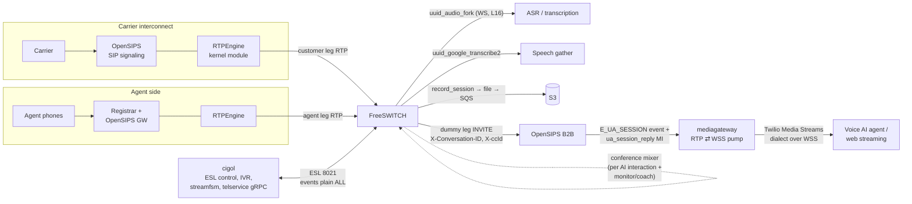
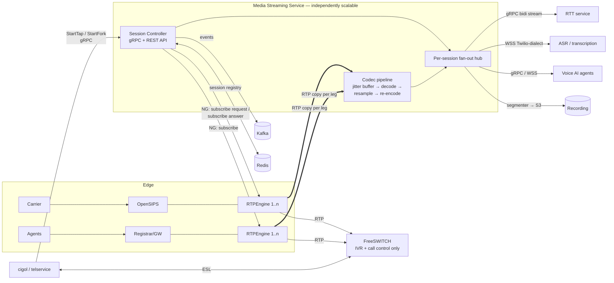
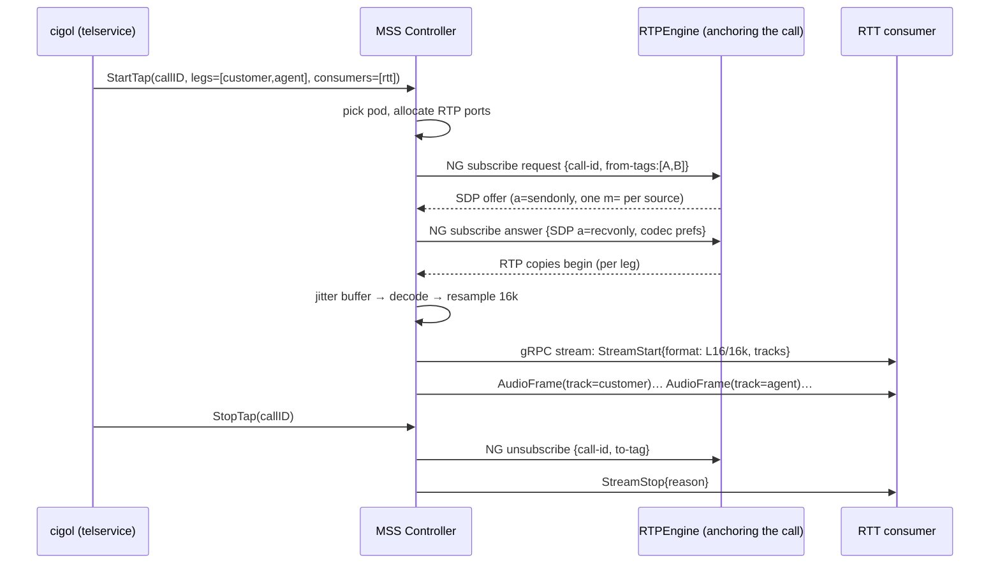
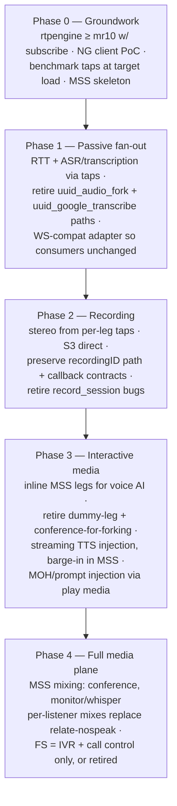

# Centralized Media Server — Architecture Proposal

**Author:** Prepared for Ashutosh Pandey / 3CLogic Telephony
**Date:** 2026-08-13 (rev. 2 — language decision locked)
**Status:** Accepted — implementation scaffolded in this repo
**Decision inputs:** Ingest = RTPEngine tap/forwarding · Build = new purpose-built service in **Rust** (single language, single codebase) · Scope = phased (fork/streaming → recording → playback/injection → full media plane)

---

## 1. Executive summary

**Yes — this is feasible, and your stack is unusually well positioned for it.** RTPEngine already touches every RTP packet on both the customer leg and the agent leg, and modern RTPEngine exposes an NG-protocol `subscribe request / subscribe answer / unsubscribe` API that hands a copy of any call participant's media to an external endpoint — with optional transcoding on the subscription leg. That means a new, purpose-built **Media Streaming Service (MSS)** can pull per-call audio taps directly from RTPEngine and fan them out to RTT (gRPC stream), ASR (WebSocket), and voice-AI consumers — **without FreeSWITCH creating a single media bug, dummy leg, or conference for forking.**

Today, every fork-shaped feature routes through FreeSWITCH and costs FS resources per call:

| Feature today | FS mechanism | FS cost per call |
| --- | --- | --- |
| Real-time transcription / RTT | `uuid_audio_fork` (forked mod_audio_fork) | 1 media bug + 1 WS connection + L16 encode |
| Speech gather / ASR | `uuid_google_transcribe2` | 1 media bug + ASR client |
| Voice AI agent | dummy leg via `originate … &conference(...)` → OpenSIPS B2B → mediagateway | 1 extra SIP leg + **1 full conference mixer** + 1 conference member |
| Recording | `record_session` media bug (`RECORD_STEREO`) | 1–2 media bugs + local file I/O |
| Monitor/whisper | conference member + `relate … nospeak` | 1 leg + mixer work per supervisor |
| Media-to-web streaming | mediagateway leg in the same conference | conference mixing overhead |

The target end-state removes all of the passive-listening load from FS in Phase 1–2, moves audio injection (bot speech, prompts into live calls) in Phase 3, and leaves a roadmap where mixing/conferencing itself moves to the MSS in Phase 4 — at which point FreeSWITCH is reduced to IVR + call-control, or replaced.

Two hard truths this document designs around:

1. **A tap is listen-only.** RTPEngine subscriptions give you a one-way copy of media. Passive consumers (RTT, ASR, transcription, recording, analytics, supervisor listen) are perfectly served. Interactive consumers (a voice-AI agent that *talks back*) need an injection path. Phase 3 handles this by making the MSS an *inline* RTP endpoint for interactive sessions (the same B2B INVITE pattern mediagateway uses today, minus the conference), while keeping the tap for everything passive. RTPEngine's `play media` exists but is file/blob-oriented (ffmpeg-decodable inputs), not a streaming TTS pipe — suitable for prompts/MOH, not for live bot speech.
2. **mediagateway is a seed, not a foundation.** It proves the concept (Go process terminates RTP, negotiates SDP, bridges to a bot over WSS) but a code audit shows it is a single-consumer, single-codec-family, no-jitter-buffer pump with hardcoded 20 ms pacing and per-pod pinned state. Section 7 catalogs exactly what a purpose-built MSS must do differently — that list is effectively the requirements delta.

---

## 2. Current state (as built, from code)



Key structural facts pulled from the two repos:

- **cigol → FS is a single long-lived inbound ESL socket** per cigol process (`eventsocket.Dial`, singleton via `sync.Once`), subscribed with `events plain ALL`, and the event fan-out **drops events when the subscriber channel is full**. Every media feature adds event volume to this one pipe.
- **The voice-AI path is a Rube Goldberg of media hops:** cigol `CreateParticipant` runs `bgapi originate {…, origination_uuid, absolute_codec_string, sip_h_X-Conversation-ID…}<dest> &conference('<name>'@default++flags{…})` — i.e., FS dials a *dummy leg* toward OpenSIPS B2B purely so that the conference's mixed audio flows to mediagateway, which answers via `ua_session_reply` and pumps RTP→WSS to the bot. One AI interaction = 1 conference mixer + 1 extra leg + 1 RTP termination, all for what is conceptually "copy this call's audio to a websocket."
- **Forking is FS-resident:** `bgapi uuid_audio_fork <uuid> start <wsURL> <mixType> <samplingRate> <streamSid> <accID> <callSid> <track> <metadataJSON>` (your forked mod_audio_fork with 4 custom positional args) and `uuid_google_transcribe2 … start` each attach a media bug to the channel. `streamfsm` then choreographs `pause/resume/send_text` around FS `playback`/`break` timing.
- **Recording is FS-resident:** `record_session` media bugs writing to a shared filesystem, with recording identity encoded in the file path (`${accountID}/${recordingID}.${fileFormat}`), uploaded via SQS jobs, callbacks driven by FS RECORD_START/STOP events.
- **Monitor/whisper is conference-resident:** supervisor joins the conference muted, then `bgapi conference '<name>' relate <datumIds> <relatedIds> nospeak` isolates who hears whom; coach = unmute while nospeak-related to the customer.
- **mediagateway is per-call pinned:** symmetric-RTP latching (client address learned from first inbound packet), one UDP port per call from a 35000–65000 pool, ~7 goroutines per call, all session state in-process; Redis only for bookkeeping. No jitter buffer, no RTCP, no SRTP, transcoding limited to µ-law↔A-law, Opus is passthrough-only, and the playout pacer is a hardcoded 20 ms ticker regardless of negotiated ptime.

### Why FreeSWITCH is the bottleneck

Every one of the six features in the table above executes inside the FS media thread pool of the *same box that is also doing IVR playback, bridging, and DTMF*. Media bugs run synchronously in the channel's media path; conferences run a mixer loop per conference; `uuid_audio_fork` does L16 conversion + WS I/O inside FS. Scaling FS means scaling *all of it together*, vertically or by adding whole FS nodes — and cigol's single ESL socket with `events plain ALL` scales event volume with call volume, in one TCP stream, with silent drops as backpressure. The load that is growing fastest (AI/ASR/RTT fan-out) is precisely the load that has no architectural reason to be on FS at all.

---

## 3. Target architecture



### 3.1 Components

**Session Controller** — the control plane. Exposes a gRPC API (plus REST for parity with today's callers) with verbs like `StartTap`, `StopTap`, `AddConsumer`, `RemoveConsumer`, `PauseConsumer`, `ResumeConsumer`, `SendText`, `StartRecording`, `StopRecording`. It owns the RTPEngine interaction: for each tap it sends `subscribe request {call-id, from-tag | from-tags, …}` to the RTPEngine instance anchoring that call, receives rtpengine's `a=sendonly` SDP offer, allocates a local RTP port, and replies with `subscribe answer` (`a=recvonly`) — optionally requesting a codec on the subscription leg so rtpengine transcodes at the tap (e.g., ask for PCMU even if the leg is Opus). Teardown is `unsubscribe`. This is the same mechanism SIPREC recording servers use with rtpengine, so it is a stable, supported surface.

**Ingest / codec pipeline** — per subscribed stream: UDP socket → RTP depacketization → **jitter buffer** (sequence reorder, loss detection, PLC for G.711) → decode to linear PCM → resample (8 kHz ↔ 16 kHz ↔ 48 kHz) → per-consumer re-encode (L16/16k for ASR, PCMU/8k for Twilio-dialect consumers, Opus for bandwidth-sensitive consumers). One decode per stream, N encodes shared across consumers wanting the same format.

**Fan-out hub** — per session, an in-process pub/sub: one ingest (or two, customer + agent leg), N subscribers. Subscribers attach/detach mid-call. Each subscriber has an independent queue with drop-oldest backpressure and per-subscriber metrics, so one slow ASR endpoint can't stall the RTT stream (a failure mode mediagateway has today — its mark-echo write blocks the RTP pacer).

**Consumer adapters:**

- *gRPC bidirectional stream* — the new native interface (sketch in §5). Server-side streaming of audio frames + events; client → server messages carry control (pause/resume/marks) and, in Phase 3, injected audio.
- *WebSocket, Twilio Media Streams dialect* — wire-compatible with what mediagateway sends today (`start/media/dtmf/stop/mark` out, `media/mark/clear/endOfInteraction` in), so existing bot/ASR endpoints migrate with zero changes.
- *Recording sink* — PCM → stereo WAV/OGG segmenter honoring the existing `${accountID}/${recordingID}.${fileFormat}` identity contract, uploading directly to S3 (no shared filesystem, no SQS hop — or keep SQS initially for compatibility).

**State & events** — session registry in Redis (which pod owns which session, consumer list, status) with CAS-safe updates; billing/lifecycle events to Kafka (reuse `MEDIAGATEWAY_BILLING_TOPIC` / `KAFKA_VOICE_AI_AGENT_TOPIC` schemas so downstream consumers don't change).

### 3.2 Why tap-based ingest scales better than everything you do today

- **Pull, not push.** The MSS *initiates* the subscription toward rtpengine. Session placement is a scheduling decision made by your control plane (any pod with capacity takes the session), not a consequence of SDP routing. This kills the hardest scaling problem mediagateway has — OpenSIPS must route the B2B INVITE to a specific pod whose `RTP_IP` is routable — and replaces it with "pod X asks rtpengine to send to pod X's address."
- **No FS involvement at all** for passive consumers. No media bug, no dummy leg, no conference, no ESL traffic. FS capacity planning decouples from AI/ASR adoption.
- **RTPEngine does the copy where the packets already are.** The kernel module keeps forwarding the primary media path; the subscription adds one userspace copy per tap on the rtpengine host. This is the same work rtpengine does for SIPREC deployments at scale. (Benchmark note: subscription legs are handled in userspace, so budget rtpengine CPU headroom — see §9 risks.)
- **N consumers, one tap.** Today three consumers of the same call's audio = three separate FS mechanisms (audio_fork WS + transcribe bug + conference leg). In the MSS it's one subscription, one decode, three subscribers on the hub.

---

## 4. Ingest deep dive: the RTPEngine tap

Sequence for a Phase-1 tap (e.g., cigol wants RTT on a live call):



Design details:

- **Leg selection.** `subscribe request` takes `from-tag` / `from-tags` to choose which participant(s) to copy; the `mix` flag can ask rtpengine to combine sources into one output stream if a mixed mono feed is wanted (cheap supervisor-listen). Prefer *separate* per-leg subscriptions for ASR/recording — you keep speaker separation for free (today `RECORD_STEREO` does this inside FS).
- **Which rtpengine to talk to.** The tap must go to the rtpengine instance anchoring the call. OpenSIPS already knows this (it picked the instance via the rtpengine/rtp_relay module). Expose it to the MSS either (a) by cigol/OpenSIPS passing the rtpengine node + call-id + tags in the `StartTap` request, or (b) by publishing call→rtpengine mapping to Redis at call setup. Direct NG from MSS→rtpengine keeps OpenSIPS out of the media-copy control path entirely; alternatively, recent OpenSIPS releases expose the same rtpengine subscribe mechanics through `rtp_relay`/SIPREC tooling if you'd rather drive it from the proxy.
- **Transcoding at the tap.** Ask for PCMU/PCMA (or even L16 where supported) in the `subscribe answer`; rtpengine transcodes the subscription leg if the call codec differs. Still implement decode/resample in the MSS — you don't want rtpengine spending CPU transcoding when the MSS can, and you need 16 kHz L16 for most ASR anyway, which is best produced from your own resampler.
- **Two taps per interaction** (customer leg at the interconnect rtpengine, agent leg at the agent-side rtpengine) when both sides are needed; one tap when only the customer side matters (voice-AI pre-agent, IVR-stage ASR — where there is no agent leg yet).
- **DTMF.** RFC 2833 telephone-events arrive in the tapped RTP; the pipeline surfaces them as DTMF events on the hub (mediagateway's `DecodeDTMF` logic — end-bit + (digit, timestamp) dedupe — is directly reusable).

---

## 5. Consumer interfaces

### 5.1 gRPC (new, native)

```proto
service MediaStream {
  // Consumer-initiated: attach to a session and receive frames.
  rpc Subscribe(stream ConsumerToServer) returns (stream ServerToConsumer);
}
service MediaControl {
  rpc StartTap(StartTapRequest) returns (StartTapResponse);
  rpc StopTap(StopTapRequest) returns (StopTapResponse);
  rpc AddConsumer(AddConsumerRequest) returns (AddConsumerResponse);     // push mode: MSS dials out
  rpc PauseConsumer(ConsumerRef) returns (Ack);                          // streamfsm pause/resume parity
  rpc ResumeConsumer(ConsumerRef) returns (Ack);
  rpc SendText(SendTextRequest) returns (Ack);                           // parity with uuid_audio_fork send_text
}

message ServerToConsumer {
  oneof msg {
    StreamStart start = 1;      // session ids, tracks, AudioFormat{encoding, sample_rate_hz, channels, ptime_ms}
    AudioFrame frame = 2;       // track, seq, pts_ms, payload (raw, NOT base64)
    DtmfEvent dtmf = 3;
    TextEvent text = 4;         // send_text passthrough: firstDtmf / dtmfResult / playbackStop / custom
    StreamStop stop = 5;
  }
}
message ConsumerToServer {
  oneof msg {
    ConsumerHello hello = 1;    // auth token, requested format (MSS re-encodes per consumer)
    AudioFrame inject = 2;      // Phase 3: bot speech toward the call (inline sessions only)
    Mark mark = 3;              // mark/clear semantics as today
    Clear clear = 4;
  }
}
```

Binary frames over HTTP/2 remove today's per-packet JSON+base64 overhead (mediagateway spends 50 JSON marshals + base64 encodes/sec/call; at 1,000 calls that's 50k/sec of pure serialization work).

### 5.2 WebSocket (compatibility)

Keep the exact Twilio-Media-Streams dialect mediagateway speaks today (`start`, `media` with base64 payload + `mediaFormat{encoding, sampleRate, channels}`, `dtmf`, `mark`, `clear`, `stop`, `endOfInteraction`) so current bot endpoints, ASR bridges, and the web-streaming consumer need no changes on day one. Same for the mod_audio_fork consumers: the MSS's WS "fork" mode should emit whatever your forked mod_audio_fork emits today (mixType/samplingRate/streamSid/track semantics), making the FS→MSS switch invisible to the ASR services.

### 5.3 Control-surface parity with cigol

The migration is dramatically simplified because **cigol already funnels every media verb through `telservice`'s gRPC API** — of its ~34 RPCs, only 7 are pure call control (`MakeCall/AnswerCall/HangupCall/ParkCall/TransferCallToSleep/SendDtmf/BridgeCall`); essentially everything else (playback/gather, recording, streaming, and 14 conference RPCs) is a media operation. The MSS's control API should mirror the streaming subset one-for-one so `callsvcclient`/`streamfsm` swap backends without FSM redesign:

| telservice RPC today (→ FS) | MSS equivalent |
| --- | --- |
| `StartStream` → `uuid_audio_fork start` | `StartTap` + `AddConsumer(ws)` |
| `StopStream` → `uuid_audio_fork stop` | `StopTap` / `RemoveConsumer` |
| `StreamPause` / `StreamResume` | `PauseConsumer` / `ResumeConsumer` |
| `StreamSendText` → `send_text '<json>'` | `SendText` |
| `StartCallTranscription` → `uuid_google_transcribe2` | `StartTap` + `AddConsumer(asr-provider)` |
| `StartRecording` → `record_session` | `StartRecording` (Phase 2) |

The `streamfsm` choreography (pause fork during non-bargeable prompts, resume for barge-in, emit `firstDtmf`/`dtmfResult`/`playbackStop`) carries over unchanged — the FSM keeps driving FS `playback`/`break` for prompts while pausing/resuming the *MSS consumer* instead of the FS media bug. The one timing contract to preserve: `PlayBackStopEvent` still comes from FS ESL events, so "stop playback → wait → resume fork" sequencing is unaffected in Phases 1–2.

---

## 6. Audio injection (Phase 3) — where the tap isn't enough

A subscription is one-way by design. Three injection options, and the recommendation:

1. **Inline MSS leg (recommended for interactive AI).** For sessions where the consumer talks back, the MSS is placed *in the media path* as an RTP endpoint — exactly what mediagateway does today, but bridged directly instead of via a conference: cigol bridges the customer channel to the MSS leg (`bridge` to an OpenSIPS B2B destination carrying `X-Conversation-ID`/`X-ccId`, answered by the MSS via `ua_session_reply`), or OpenSIPS routes the leg to the MSS before FS is involved at all (pre-IVR AI agents — FS fully bypassed). Full duplex: caller audio out to the bot, bot audio (streaming TTS) back in, barge-in handled in the MSS (stop playout on caller speech). This replaces the dummy-leg + conference construct with a plain two-party bridge.
2. **`play media` via rtpengine NG** — good for *file-shaped* injection (prompts, MOH, comfort messages) into tapped calls: `play media {call-id, from-tag|all, file|blob, repeat-times, codec-set, block egress}`; anything ffmpeg decodes. Not suitable for continuous streaming TTS, but a cheap win for "MSS-driven MOH" (killing the `file_string://moh!moh!…!silence_stream://-1` hack) and filler audio. **Measured against 14.1.1.8** (`lab/ng_inject_probe.py`): audio reaches the call, `from-tag` selects the single participant who hears it (whisper-shaped targeting), `all: "all"` reaches both, and `blob64` is rejected — the blob must be raw bytes.
3. **rtpengine `publish`** — ~~injects a new media source into a call without offer/answer~~ **disproven for 14.1.1.8** (`lab/ng_inject_probe.py`): rtpengine accepts `publish`, answers with a `recvonly` SDP and happily receives RTP on the offered port, but that media never reaches the call's participants. It is a broadcast source for `subscribe`-ers, not an injector into an existing call's media matrix. Injection into a live call is therefore `play media` (utterance-shaped) or an inline leg (streaming), with nothing in between.

Rule of thumb for the end-state: **taps for ears, inline legs for mouths.** Passive consumers stay on subscriptions; each interactive session gets one inline MSS leg; both feed the same fan-out hub so an interactive AI session can *also* serve RTT/recording subscribers from the same pipeline.

---

## 7. Lessons from mediagateway: the build checklist

### 7.1 Requirements delta from the mediagateway audit

The audit of `mediagateway` produced a concrete list of what the purpose-built service must do differently. Treat this as hard requirements:

| # | mediagateway today | MSS requirement |
| --- | --- | --- |
| 1 | No jitter buffer; packets forwarded in arrival order; seq/timestamp ignored | Proper jitter buffer per ingest stream: reorder, dedupe, loss detection, bounded delay (start ~40–60 ms adaptive), PLC for G.711 |
| 2 | Hardcoded 20 ms ticker regardless of negotiated ptime; drift never corrected | Pacing derived from negotiated ptime; wall-clock-anchored scheduler (send when `t0 + n·ptime` passes), not a naive ticker |
| 3 | Mark-echo WS write inline on the pacing goroutine (2 s timeout) can stall audio | Strict isolation: pacing loop never does network I/O with unbounded/blocking semantics; all consumer I/O behind per-consumer queues |
| 4 | Single consumer per session, hard-wired | Fan-out hub, N consumers, attach/detach mid-call, per-consumer format + backpressure |
| 5 | Transcode = µ-law↔A-law only; no resampling; Opus passthrough; codec mismatch silently passes garbage | Full pipeline: G.711/G.722/Opus decode+encode, 8k/16k/48k resample, L16 output; reject-or-transcode, never pass mismatched bytes |
| 6 | Port pool O(N)-under-mutex, one port per call, no RTCP | Free-list/bitmap allocator O(1); RTCP optional but socket pair reserved; `SO_REUSEPORT` + `recvmmsg` batching instead of per-call read goroutine spin loops (50 syscalls/sec/call today) |
| 7 | Redis session JSON read-modify-write, no CAS → lost updates | Versioned writes (WATCH/Lua or per-field hashes) |
| 8 | Per-datagram goroutine for OpenSIPS events → INVITE/BYE races per b2b key | Per-session serialized event queues (cigol's streamfsm sharding pattern is the right one) |
| 9 | `ptime=0` parse path → integer divide-by-zero panic; answers Opus with no rtpmap; strips telephone-event from answers | Hardened SDP handling (or lean on rtpengine to normalize — subscription SDP comes from rtpengine, which is well-formed) |
| 10 | Pod-crash "recovery" is billing bookkeeping only; orphaned legs never torn down | Session registry with ownership leases; on pod death, controller re-establishes taps on a healthy pod (subscriptions are re-creatable — a *huge* HA advantage over inline legs) and tears down orphaned rtpengine subscriptions |
| 11 | JSON + base64 per 20 ms frame per consumer | Binary gRPC frames natively; base64/JSON only on the WS-compat adapter |
| 12 | No SRTP/DTLS/ICE | Fine to keep out of MSS: rtpengine terminates crypto at the edge; subscription legs are plaintext RTP on the private network. Revisit only if taps cross trust boundaries |

### 7.2 Language decision: Rust

**Decision (2026-08-13): Rust, single service, single codebase.** Rationale: deterministic latency is a hard requirement (no GC in the media path, by construction rather than by tuning); the Phase-4 end-state — a full media plane with per-listener conference mixing — is exactly the workload where no-runtime, cache-friendly code pays off; and this service is a decade-horizon strategic asset, which is the amortization window where Rust's upfront cost is recovered. Go was evaluated and is technically viable for Phases 1–2 (sub-ms GC pauses vs a 20 ms frame budget), but was ruled out against the latency-determinism requirement and the Phase-4 mixer.

**The two-world architecture (non-negotiable):**

- **Control world — Tokio.** Session API (tonic gRPC + REST), RTPEngine NG client, Redis session registry, Kafka producers, consumer WebSocket/gRPC I/O. Async is the right tool here; nothing in this world touches a packet deadline.
- **Media world — dedicated OS threads.** One worker thread per core (pinned), each owning its sessions end-to-end: UDP sockets (`recvmmsg` batched), jitter buffers, codec state, fan-out queues, playout pacing. Wall-clock-anchored deadlines (`t0 + n·ptime`, never naive tickers), zero heap allocation per packet, no locks on the packet path — sessions are pinned to one worker so there is no cross-thread packet handoff.
- The worlds communicate over bounded lock-free queues; the media world never blocks on the control world.

**Sans-IO cores.** All protocol and DSP logic (RTP, jitter, G.711, DTMF, NG bencode, consumer dialects) is written as pure state machines with time as an explicit parameter — no sockets, no clocks, no async in those crates. This is the answer to "it's a media service, we can't see it": every core is testable by replaying captured pcaps byte-for-byte, and production incidents reduce to "capture, replay, fix, add the capture as a regression test."

**Supervision.** Tokio tasks die silently on panic; a media session whose pump died must never mean a silently dead call. Every session gets an audio-flow watchdog (no frames emitted for N ms while nominally flowing → stalled event → tap re-subscribe), join-handle supervision on every spawned task, and per-session heartbeats exported as metrics.

**Crate map:**

| Concern | Crate | Notes |
| --- | --- | --- |
| Async runtime / gRPC | `tokio`, `tonic`, `prost` | control world only |
| RTP/RTCP types | in-tree (`media-core`) or `rtp`/`rtcp` (webrtc-rs) | in-tree parser is ~200 lines, zero-dep |
| G.711 | in-tree (`media-core::g711`) | verify against ITU vectors before GA |
| Opus | `audiopus` (libopus FFI) | PLC/FEC come with the decoder |
| Resampling | `rubato` (pure Rust) or libsoxr FFI | 8k/16k/48k |
| File decode (prompts) / encode (recording) | `symphonia`, `hound`, `ogg` | pure Rust |
| VAD / denoise (later) | Silero via `ort`, `nnnoiseless` | better than anything FS ships |
| RTPEngine NG | in-tree (`rtpengine-ng`) | bencode + subscribe lifecycle, sans-IO |
| Kafka / Redis | `rdkafka`, `redis-rs` | reuse existing topics/schemas |
| Consumer dialects | in-tree (`protocol`) | Twilio Media Streams + audio_fork send_text, wire-compatible |
| Phase-4 mixer fallback | `gstreamer-rs` | held in reserve; see §9/Appendix A |

**Zero `unsafe`** outside vetted dependency crates (enforced with `#![forbid(unsafe_code)]` per crate once FFI boundaries are settled — FFI wrappers live in dedicated crates).

**Cost accepted:** ~1.5× the calendar time of a Go build for Phase 1, spent mostly on the two-world architecture and protocol plumbing. The de-risking Phase-0 spike (NG client + jitter buffer + one tap dumped to WAV, benchmarked) is mandatory before the fan-out hub is built.

---

## 8. Scaling & deployment model

**Per-session cost (MSS pod):** a passive tap of both legs at G.711/20 ms is ~100 pkt/s in, one decode+resample, and per-consumer encodes — comfortably a few thousand concurrent sessions per modern 8-core pod if the hot path is allocation-free and sockets are batched (`recvmmsg`/`sendmmsg`). Interactive inline sessions cost roughly 2× (bidirectional + playout pacing). These are estimates to validate in the Phase-0 benchmark, not promises.

- **Placement:** the controller assigns each new session to a pod (least-loaded / consistent-hash on call-id). Because taps are pull-initiated, no ingress SDP routing problem exists for passive sessions. Inline legs (Phase 3) still need pod-addressable RTP — same hostNetwork/port-range exposure mediagateway uses today (35000–65000/udp per pod), or a small dedicated port range per pod.
- **Autoscaling:** HPA on active-session count + CPU; graceful drain = stop accepting sessions, let existing ones end (calls are minutes-long, so scale-in is slow by nature — plan for it).
- **HA:** ownership leases in Redis (TTL'd, renewed by heartbeat). On pod loss: passive taps are *re-subscribed* from another pod within a second or two (audio gap, session survives — dramatically better than today, where a mediagateway pod crash orphans the call until the B2B leg times out); inline sessions fail like any media endpoint failure and need call-control-level recovery.
- **Kernel-module note:** RTPEngine's kernel fast path keeps doing the primary A↔B forwarding; each subscription adds userspace work on the rtpengine host (packet copy + optional transcode). Capacity-plan rtpengine for "every call tapped" — measure, and scale rtpengine horizontally (you already run multiple instances; taps go to the instance owning the call).
- **Observability:** per-session/per-consumer metrics (ingest loss %, jitter, queue depth, consumer lag, injected-audio underruns), pprof, and RTP-level counters exported to Prometheus. Silent-drop counters (today's `"queue full, dropping"` logs) must be first-class metrics with alerts.

---

## 9. Phased migration plan



**Phase 0 — Groundwork (de-risk before building).** Confirm your rtpengine version supports `subscribe request/answer/unsubscribe` (and upgrade path if not); PoC: NG client subscribes to a test call and dumps both legs to WAV; load-test taps on a production-shaped rtpengine node to price the userspace copy; decide call→rtpengine-instance discovery (Redis mapping written at call setup is the least invasive). Deliverable: measured per-tap cost + working ingest prototype.

**Phase 1 — Passive fan-out (the 80% win).** Build MSS core (controller, ingest pipeline, hub, gRPC + WS-compat adapters). Route RTT and ASR/transcription through it: cigol's `StartStream`/`StartCallTranscription` handlers call MSS instead of FS. mod_audio_fork and mod_google_transcribe stay installed but idle; feature-flag per tenant for rollback. FS sheds all fork media bugs + their ESL event volume. *Success metric: zero `uuid_audio_fork` invocations at steady state; FS CPU per call drops measurably.*

**Phase 2 — Recording.** Per-leg taps → stereo segmenter → S3. Preserve: `${accountID}/${recordingID}.${fileFormat}` identity, `recordStart/recordStop/recordPause/uploadCompleted` callback semantics (incl. pause = segment + defer + accumulate duration), SQS pipeline if downstream depends on it (or bypass to direct S3 and keep only the callback contract). Hold/pause state now comes from cigol events rather than FS media-bug state — cigol already tracks `HoldState`/`PauseState` in Redis. *Retires `record_session` bugs and the FS shared-filesystem dependency.*

**Phase 3 — Interactive media.** Inline MSS legs for voice-AI: OpenSIPS routes (pre-agent AI) or cigol bridges (mid-call transfer) the leg straight to MSS — no conference, no dummy leg. Streaming TTS in over gRPC, jitter-buffered playout, barge-in cut-through in MSS. vaiorchestrator's `callMediaGateway` becomes `callMSS` (same create-conversation-then-INVITE handshake — keep the `X-Conversation-ID` correlation). Prompt/MOH injection into tapped calls via rtpengine `play media` where file-shaped audio suffices. *Retires the conference-per-AI-interaction and the mediagateway service itself (MSS supersedes it).*

**Phase 4 — Full media plane (roadmap).** MSS grows an N-way mixer: conferences as first-class MSS sessions built from per-participant inline legs + per-listener mix matrices. Monitor = subscriber on the hub (no leg at all — a supervisor "listening" is just a consumer); whisper = injection routed only into the agent's mix (a mix-matrix entry, replacing `relate … nospeak`); barge = flip the matrix. This is the hardest phase (mixing quality, conference-scale fan-in, and the long tail of conference features: enter/exit sounds, member controls, conference recording) and should only start once Phases 1–3 are boringly stable. If the hand-rolled mixer disappoints, the fallback is embedding GStreamer per-session pipelines via `gstreamer-rs` (`rtpjitterbuffer` → decode → `audiomixer`) — first-class Rust bindings, twenty years of hardened mixing code (see Appendix A). It is also optional: FS-as-conference-appliance behind an MSS media plane is a legitimate stable end-state.

### What stays on FreeSWITCH (until Phase 4, possibly forever)

`originate/answer/hangup/park/transfer/bridge/send_dtmf`, IVR `playback`/`play_and_get_digits`/`break`, TTS prompt playback, and conference mixing. That's the 7 pure-control RPCs plus prompting — the things FS is excellent at and that don't scale with AI adoption.

---

## 10. Risks & open questions

1. **rtpengine version & subscribe maturity.** `subscribe` is the newest of the primitives used here. Verify your deployed version; test edge cases (re-INVITE/codec change mid-tap, hold/unhold on the tapped leg, call transfer moving the leg to another rtpengine). Mid-call re-anchoring will require re-subscription logic.
2. **rtpengine CPU headroom.** Subscriptions bypass the kernel fast path for the copied stream. If "every call tapped" doubles rtpengine userspace load, you may need to grow the rtpengine tier — still far cheaper than growing FS, but measure in Phase 0.
3. **Call→rtpengine discovery.** Needs a reliable mapping (OpenSIPS writes call-id → rtpengine-node + tags to Redis at setup). Get this into the OpenSIPS config early; everything else depends on it.
4. **Forked mod_audio_fork consumers.** Your ASR services consume a *custom* fork dialect (extra positional args, specific metadata JSON). The WS-compat adapter must replicate it exactly — pull the fork's source to spec the wire format before Phase 1.
5. **streamfsm timing.** Pause/resume of the MSS consumer replaces pause/resume of the FS media bug. Latency differs slightly (network hop vs in-process bug). Validate barge-in feel (prompt-echo suppression) under load in Phase 1 pilots.
6. **Recording compliance.** Recording via tap changes the failure domain: if the MSS pod dies, recording gaps until re-subscribe. If you have zero-gap compliance requirements for some tenants, keep `record_session` as a per-tenant fallback through Phase 2, or run dual-recording during the transition.
7. **Sizing assumptions.** The per-pod session estimates in §8 are engineering estimates; the Phase-0 benchmark exists to replace them with numbers before you commit capacity plans.
8. **Team surface area.** You'll operate a new stateful-ish media tier. Mitigation: passive taps are stateless-recoverable (re-subscribe), which makes the Phase 1–2 service much more forgiving to operate than a B2BUA; the genuinely stateful part (inline legs) arrives only in Phase 3, after the team has operational experience.

---

## Appendix A — "Everything FreeSWITCH does": capability → library map (Rust)

FreeSWITCH itself wraps C libraries (libopus, spandsp, libsndfile, ffmpeg) and orchestrates them with a bespoke engine — the same libraries are FFI-able from Rust, mostly with maintained bindings. The decomposition for the MSS:

| FS capability we use today | What it actually is | Rust path | Build from scratch? |
| --- | --- | --- | --- |
| G.711 µ/A-law | Table lookup | in-tree (~150 lines) | Trivial |
| Opus encode/decode (+PLC/FEC) | libopus (same lib FS uses) | `audiopus` bindings — mature | No |
| G.722 | spandsp/libg722 | FFI, or small Rust ports | No |
| Resampling 8k/16k/48k | DSP | `rubato` (pure Rust) or libsoxr FFI | No |
| Jitter buffer + reorder | Policy code | pieces exist (str0m, webrtc-rs); NetEQ-class is C++ FFI | **Yes (~1k lines) — and we want to own it** |
| RTP/RTCP/RFC 2833 | Packet formats | in-tree + `rtp`/`rtcp` crates; DTMF ~100 lines | No |
| File playback (prompts, MOH) | Decoders | `symphonia` (wav/mp3/flac/aac), `hound`; `ffmpeg-next` if ever needed | No |
| Recording to wav/ogg + S3 | Encode + I/O | `hound`/`ogg`/`opus` + AWS SDK | No |
| Conference mixing | Sum-and-saturate DSP + per-listener mix matrix | mixing math trivial (`dasp` helps); **no off-the-shelf conference engine exists in any language** | **Yes — this is the product** |
| VAD / barge-in | Model or DSP | `webrtc-vad` bindings, Silero via `ort` | No |
| Denoise / AGC | DSP/ML | `nnnoiseless` (pure-Rust RNNoise), speexdsp FFI | No |
| Tone gen/detect | DSP (Goertzel) | ~100 lines or spandsp FFI | Trivial |
| TTS | HTTP/gRPC provider clients | plain clients (logic exists in cigol) | No |
| SIP stack | — | **Not needed**: OpenSIPS remains the SIP layer; MSS answers B2B legs via MI events (mediagateway pattern) | Avoided |
| SRTP/DTLS | libsrtp | RTPEngine terminates crypto at the edge | Avoided |

Net: ~80% of the FS capability surface we use is commodity libraries or trivial DSP; the ~20% built from scratch (jitter policy, mixer engine, session/fan-out machinery) is precisely the engine this project exists to own. Licensing is permissive throughout (G.729 patents expired; MP3 patent-free).

**GStreamer escape hatch:** `gstreamer-rs` bindings are first-class (GStreamer's own team ships Rust plugins upstream). An MSS variant embedding GStreamer per-session pipelines (`udpsrc → rtpjitterbuffer → decode → audioresample → appsink`, `audiomixer` for conferences) inherits hardened media code at the cost of carrying the GStreamer runtime. Decision: hand-roll the narrow audio-only pipeline; prototype both in Phase 0; keep GStreamer as the Phase-4 mixer fallback.

---

## 11. Sources

- [rtpengine NG control protocol — subscribe request/answer, unsubscribe, publish, play media, block/silence media](https://rtpengine.readthedocs.io/en/latest/ng_control_protocol.html)
- [SIPREC with RTPEngine — subscribe-based media forking walkthrough (incl. transcoding on subscription legs)](https://cloudtelcohub.com/posts/siprec-with-rtpengine/)
- [OpenSIPS SIPREC module docs](https://opensips.org/docs/modules/3.6.x/siprec) · [OpenSIPS rtp_relay module](https://opensips.org/docs/modules/3.2.x/rtp_relay.html) · [OpenSIPS + RTPEngine subscribe support discussion](https://github.com/OpenSIPS/opensips/issues/2732)
- [OpenSIPS 3.1 enhanced media capabilities](https://blog.opensips.org/2020/03/26/enhanced-media-capabilities-in-opensips-3-1/) · [Media re-anchoring in OpenSIPS 3.2](https://blog.opensips.org/2021/06/09/media-re-anchoring-using-opensips-3-2/)
- Codebase analysis: `mediagateway` (engine/call/streaming, codec, opensips MI, rtp, mediaservice, conversation, kafkamanager, api, config) and `Telephony/cigol` (telephony/freeswitch fs_api/fs_conf_api/fs_conn, streamfsm, vaiorchestrator, monitorCoachHandler, receventhandler, telservice) — August 2026 working copies.
