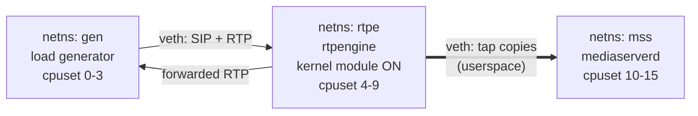

# Testing the media plane

How this service gets proven, at every altitude, from a unit test to a
capacity number. It exists because "it's a media service, we can't see it"
is the failure mode this project was designed against
([architecture.md §7.2](architecture.md)), and seeing it requires
infrastructure that does not build itself.

[lab.md](lab.md) documents the lab that exists today. This document is the
plan for what testing must become, and — deliberately — what it can never
give you.

## The three altitudes

| Altitude | Where | Speed | Proves |
| --- | --- | --- | --- |
| Replay | `cargo test --workspace` | seconds | Every protocol/DSP decision, byte-for-byte, deterministically |
| Lab | WSL2 on one machine | minutes | That real rtpengine, real SIP and real impairment behave as the replay tests assume |
| Benchmark | one quiet metal box, cpuset-isolated | hours | Per-tap cost — and nothing else |

The altitudes are ordered by how often you should be running them, and the
ordering is not an accident: **the lab's primary output is not a pass/fail,
it is fixtures for the replay tier.** Every real datagram the lab captures
should end up in a `media_core::replay::DatagramLog` and become a test that
runs in CI forever. Article III's "capture, replay, fix, keep the capture"
only works if capture is routine.

That change landed 2026-08-16: with `MSS_TAP_DATAGRAM_LOG_DIR` set (both
compose files set it to `/out`), every tap writes `tap-<track>.dglog` in
the `DatagramLog` length-prefixed format alongside the WAV, bounded and
truncation-flagged so logging can never become the hot-path problem.
`captured_datagrams_round_trip_into_the_replay_tier_byte_exact` proves a
capture replays byte-for-byte. Every lab run now leaves behind evidence;
the remaining habit is promoting interesting captures into committed
fixtures.

## The split: WSL2 for behavior, a quiet box for the number

Decided 2026-08-15. Functional testing lives permanently on WSL2. The M2
capacity number is measured on a short-lived, cpuset-isolated metal box and
nowhere else — WSL2 gives a rough shape first, and the metal box is
provisioned only if that shape turns out to be tight.

The two activities have profiles so different that one environment serving
both would be badly shaped for each:

| | Functional lab | Benchmark |
| --- | --- | --- |
| Concurrent calls | **2–10** | 500–1000 |
| Run frequency | daily | roughly five times, ever |
| Optimizes for | iteration speed, a debugger, `tcpdump` | repeatability |

Hold, transfer, DTMF dedupe, re-anchoring, impairment, lease failover — all
of it reproduces at a handful of calls. Only the capacity number wants
scale and a quiet machine, and reproducing a bug should never require
provisioning a fleet.

## The functional box: WSL2

Decided 2026-08-15. The functional lab is **WSL2 on Windows**, with
everything inside a single distro.

### Why not macOS

Three independent reasons, all hard:

1. rtpengine's fast path is a Linux netfilter module (`xt_RTPENGINE`).
   There is no macOS equivalent and no Homebrew formula.
2. Docker Desktop on macOS has no real `--network host`, so anything
   crossing the host boundary is fragile — the reason the current lab pins
   every address inside a bridge network.
3. `tc netem`, the impairment tool this entire plan leans on, is Linux
   traffic control. There is no substitute.

WSL2 answers all three: a real Linux kernel, real bridge networking, and
real traffic control.

### Setup that matters

**Install Docker natively inside the distro** (`apt install docker.io`),
not Docker Desktop with the WSL2 backend. Docker Desktop reintroduces a
networking layer between you and the bridge, which is precisely what this
move exists to escape. Native docker gives a plain Linux bridge that netem
can attach to and `tcpdump` can see.

`C:\Users\<you>\.wslconfig`:

```ini
[wsl2]
processors=12
memory=24GB
networkingMode=mirrored
nestedVirtualization=true
```

`networkingMode=mirrored` needs Windows 11 22H2 or later. On Windows 10 the
default NAT mode is fine, because all three roles live inside the distro
and their traffic never reaches the Hyper-V vSwitch.

`/etc/wsl.conf`, so OpenSIPS and rtpengine can run as services rather than
being containerized:

```ini
[boot]
systemd=true
```

### Verify before building anything on top

```sh
uname -r
zcat /proc/config.gz | grep -E 'NET_SCH_NETEM|NETFILTER_XT_'
sudo tc qdisc add dev lo root netem loss 1% && sudo tc qdisc del dev lo root
```

If netem is absent, building a custom WSL2 kernel is a documented path
(clone `microsoft/WSL2-Linux-Kernel` at the tag matching `uname -r`, build,
point `.wslconfig` at the `bzImage`). Budget half a day, once.

### The kernel module: skip it here

`xt_RTPENGINE` is out-of-tree and WSL2 ships no matching headers, so
getting it requires that same custom-kernel detour. Do not bother for
functional work — [lab.md](lab.md) already makes the argument that
subscription legs are userspace work, so the kmod is near-irrelevant to tap
correctness. Keep running `--table=-1`.

The kmod matters only on the benchmark rig, where the kernel fast path is
the *baseline* the userspace tap cost is measured against. Running
rtpengine fully userspace there would measure a different thing entirely.

### Tiers, in the order they earn their keep

**Tier 1 — real signalling and real impairment.** The jump from today's
lab, and the one that matters most.

| Component | Adds | Notes |
| --- | --- | --- |
| OpenSIPS 3.x + `rtpengine` module | Offer/answer, re-INVITE, hold/unhold, transfer as production emits them | Also the place to prototype the call-id → rtpengine-node Redis mapping, an open M2 item |
| SIPp ×2 (caller, callee) with pcap media | Real SIP scenarios, and DTMF/hold at handful-of-calls scale | Replaces `lab/call_driver.py`, which cannot pace — see below |
| `tc netem` on the tap-facing link | Loss, reorder, duplication, jitter, bursts | **The single highest-value item on this list** |
| Prometheus + Grafana | Article VIII counters become visible instead of theoretical | Silent-drop counters must be graphed, not logged |

**Tier 2 — control-plane dependencies.** Redis, Redpanda (Kafka API,
single binary), MinIO (S3 API), a stub WebSocket ASR server and a stub gRPC
RTT sink that both record what they received. Build this when M4 lands the
fan-out hub, not before — none of it has a caller today.

**Tier 3 — FreeSWITCH + the legacy controller.** Needed only for Phase-1 parity: the legacy stream fsm
pause/resume choreography and barge-in timing
([architecture.md §10 risk 5](architecture.md)). Heavy to stand up, and
worth deferring until there is an MSS consumer to compare against.

**Tier 4 — HA and multi-instance.** Two `mediaserverd` processes with
`kill -9` for lease expiry and re-subscribe; two rtpengine instances on
different ports for transfer and re-anchoring. Both fit inside one distro —
the multi-instance behaviors are *not* what a single machine struggles
with.

### Sizing

Per tapped two-party call at G.711/20 ms, counting every datagram that
crosses the box:

| Hop | Packets/sec |
| --- | --- |
| Generator → rtpengine (both endpoints) | 100 |
| rtpengine → endpoints (forwarding) | 100 |
| rtpengine → MSS (tap copies, both legs) | 100 |
| MSS receive | 100 |
| **Aggregate** | **~400** |

A G.711/20 ms datagram on the wire is ~200 bytes, so ~640 kbps of aggregate
box traffic per call.

| Concurrent calls | Aggregate pps | Aggregate bandwidth | Fits in WSL2? |
| --- | --- | --- | --- |
| 10 (functional work) | 4k | ~6 Mbps | trivially |
| 100 | 40k | ~64 Mbps | yes, on a decent laptop |
| 500 | 200k | ~320 Mbps | benchmark rig |
| 1000 | 400k | ~640 Mbps | benchmark rig |

Memory is a non-issue: a 60 ms jitter buffer at 8 kHz mono is under a
kilobyte, and per-session state is dominated by socket buffers. Give WSL2
as many processors as the laptop can spare; RAM barely matters.

## The impairment matrix

The lab's one clean run reported **zero** concealed, lost, duplicated, late
or reset packets ([lab.md](lab.md)). That is what a Docker bridge looks
like, and it means `media_core::jitter` — a component the architecture
calls out as one of the few things worth building from scratch — has never
executed its interesting paths against real traffic.

`tc netem` fixes that. Impair in two distinct places, because they test
different things:

- **On the tap link (rtpengine → MSS).** Damage that only the MSS sees.
  This is the jitter buffer's own test.
- **Upstream of rtpengine (endpoint → rtpengine).** Damage the primary path
  inherits and forwards into the tap. Tests that we attribute loss to the
  right place and do not double-count what was already lost.

| Scenario | Injection | What must hold | Covered by |
| --- | --- | --- | --- |
| Uniform loss | `loss 1%`, `5%` | Reported loss tracks injected loss; concealment count equals detected-loss count | ✅ `uniform_loss_is_reported_once_and_concealed_once` (drop 1-in-100 and 1-in-20 over 200 packets) |
| Burst loss | `loss 10% 50%` (correlated) | PLC engages; output sample count stays wall-clock correct across the gap | ✅ `a_burst_of_loss_engages_plc_and_keeps_the_frame_clock_honest` (8 consecutive drops; first concealed frame carries audio, the tail is muted, played + concealed == packets) |
| Reorder inside buffer depth | `delay 30ms 20ms reorder 25% 50%` | Zero reported loss; samples emerge in sequence order | ✅ `reorder_inside_the_buffer_depth_costs_no_loss` (`DelayOne` every 10th, depth 4) |
| Reorder beyond buffer depth | `delay 120ms 60ms reorder 25% 50%` | Counted as late, not as loss — the counter partition must be exhaustive and non-overlapping | ✅ `reorder_beyond_the_buffer_depth_is_late_not_lost` (one packet 7 slots late: 1 late drop, 1 loss, 0 duplicates, `received` == wire length) |
| Duplication | `duplicate 1%` | Deduped; total sample count unchanged | ✅ `duplication_is_deduped_and_costs_no_samples` |
| Jitter, no loss | `delay 20ms 15ms distribution normal` | Zero loss; underruns bounded; pacer deadline misses stay inside budget | ✅ `arrival_jitter_without_loss_grows_the_cushion_and_plays_everything` (±15 ms arrival schedule through `ingest_at`; the adaptive depth grows, underruns stay inside the cushion). Pacer deadline misses are a lab measurement, still unmade |
| **DTMF on a clean link** | none | **Zero reported loss** — events are accounted, not lost | ✅ closed 2026-08-16: `a_dtmf_press_on_a_clean_link_reports_zero_loss` in CI, and the lab run shows `jitter_lost: 0` with `frames_suppressed` = event count |
| DTMF under loss | `loss 2%` + repeating digits | Digits still deduped once per press; loss count excludes telephone-event sequence numbers | ✅ `a_dtmf_press_under_loss_still_reports_one_digit_and_only_audio_loss` |
| Silence suppression | endpoint stops sending / sends comfort noise | The gap is **not** loss: timing preserved, `silence_gaps` counted, PLC history forgotten | ✅ `a_silence_suppressed_talkspurt_gap_is_not_loss`, `a_dropped_comfort_noise_packet_is_absorbed_as_silence_not_loss` |
| Mid-call SSRC change | re-INVITE | Restart, not a run of late drops; `resets` moves with `ssrc_changes` | ✅ `a_new_ssrc_at_a_nearby_sequence_restarts_instead_of_dropping_late` |

**Status (2026-08-22, tasks item 17):** every row above is covered at the
**replay** altitude — `impairment_matrix` in `crates/media-core/src/pipeline.rs`,
built from `replay.rs` (`disturb` scripts for order and multiplicity, explicit
arrival schedules for time) and driven through a lag-based pacer so playout
trails arrival by the target depth the way a wall-clock pacer does. What is
**not** yet done: none of these has been reproduced with real `tc netem` on a
real tap link, and nothing has judged the concealment perceptually. Those two
are the remaining value in this matrix, and `lab/ear_intelligibility_probe.py`
under burst loss is the cheap version of the second.

Every lab run in this matrix should dump its datagram log. The interesting
ones become permanent replay fixtures, which is how an impairment scenario
stops costing a lab and starts costing 40 ms of CI.

## The load generator problem

`lab/call_driver.py` already underran the pacer by 58 packets per leg at
**one call** ([lab.md](lab.md)). Python cannot hold 50 pps precisely, and
it certainly cannot hold 50k. Any capacity number produced with it would be
a measurement of the generator.

Two generators, split by what each is for:

- **SIPp** for scenario testing: registration, INVITE, re-INVITE, hold,
  transfer, BYE at realistic call rates, with pcap media replay. Mature,
  and nobody should write a SIP load tool.
- **A small Rust generator in-tree** for the pure-RTP benchmark, where
  pacing accuracy *is* the measurement and the generator must be pinned to
  its own cores. It can reuse `media_core::rtp` to build packets and should
  emit a deterministic per-leg payload so channel identity stays verifiable
  the way `call_driver.py`'s distinct-digit trick does today.

Requirements for the Rust one: hold ptime-derived pacing within ±1 ms over
hours, N calls per process, injectable DTMF, and its own pacing-error
histogram so it can prove it was not the bottleneck.

## The benchmark rig

### Why WSL2 cannot produce this number

Not for lack of speed — for lack of **repeatability**. Underneath the WSL2
VM sits a Windows scheduler running a browser and a chat client, deciding
when the vCPUs get to run. The pacer is wall-clock-anchored so it will not
drift, but it *will* miss deadlines whenever the host deschedules it, and
those miss as underruns indistinguishable from a pipeline fault. Add laptop
thermal throttling and two runs an hour apart disagree. The result would
describe the laptop, not the service.

### One box, three network namespaces

Not three cloud nodes. Three SSH sessions, three log sets, and VPC
plumbing buy less isolation than they cost. Instead: **one machine, three
network namespaces** joined by veth pairs, each pinned to a disjoint
`cpuset`.



This keeps everything M2 actually needs. Separate namespaces give separate
virtual interfaces, so per-role packet counters and netem still work.
Disjoint cpusets give clean per-role CPU accounting — including the
rtpengine-side number, which is the open risk in
[architecture.md §10 risk 2](architecture.md) and the reason the generator
must not share cores with it. What remains shared is memory bandwidth and
last-level cache: real, but far smaller than co-scheduling on the same
cores, and one machine to debug.

Rent metal rather than AWS. A dedicated box from a bare-metal provider is
tens of euros a month, boots in minutes, and is just a machine with an IP —
no VPC, no security groups, no instance-type archaeology. For a workload
that is stood up perhaps five times over the project's life, that
simplicity is worth more than elasticity.

### Escalate only if the answer is tight

Do not pay for isolation before knowing whether the answer is
uncomfortable. Run the benchmark **on WSL2 first** for a rough shape:

- If it reports something like 800 taps per core, the margin is wide enough
  that the imprecision does not change any decision. Write it up with the
  caveat and move on.
- If it reports something like 120 taps per core, the capacity plan turns
  on the exact figure. That is when the metal box earns its money.

### Method

Measure the **slope, not the average**. Run each step to steady state,
hold it for at least ten minutes, and regress CPU against tap count:

| Step | Calls | Taps | Purpose |
| --- | --- | --- | --- |
| 0 | 500 | 0 | Baseline: what rtpengine costs forwarding with the kernel module, untapped |
| 1 | 500 | 100 | |
| 2 | 500 | 500 | Every call tapped — the Phase-1 steady state |
| 3 | 1000 | 1000 | Headroom check |

Per-tap cost is the slope of that line. Dividing total CPU by tap count
folds in fixed overhead and flatters the result.

### What to record at each step

- Per-core CPU for all three cpusets, split user/system/softirq (`mpstat`).
  On rtpengine the interesting number is the **softirq and userspace delta
  from step 0**, because the kernel module keeps handling the primary path
  while the tap copy is userspace work.
- UDP receive-buffer errors (`netstat -su`, `ss -uam`). A drop here
  invalidates the step — it means you measured a saturated socket, not a
  pipeline.
- MSS internal counters: jitter loss, concealment, late, underruns,
  releases, reanchors.
- Pacer deadline miss distribution, p50/p99/p99.9.
- Generator pacing error, to prove step validity.

### M2 exit criteria mapping

| Criterion (roadmap M2) | Where it comes from | Status |
| --- | --- | --- |
| WAV artifact from a real tapped call | Existing docker lab | ✅ done 2026-08-14; a real-softphone call via OpenSIPS 2026-08-15 |
| Measured per-tap cost, MSS side | `mss` namespace, slope across steps | 🔶 WSL2 rough shape 2026-08-16, see below |
| Measured per-tap cost, rtpengine side | `rtpe` namespace, delta vs step 0 | ⬜ |
| Discovery mechanism agreed | Organizational — OpenSIPS config owners | ⬜ prototyped in the lab (`call_watcher.py` polls rtpengine; the real design stays OpenSIPS → Redis) |

### The WSL2 rough shape, recorded

Criterion on this box, 2026-08-16 (`cargo bench -p media-core`): the full
per-packet pipeline — RTP parse, jitter admission, pop, G.711 decode —
costs **244 ns/packet** (`parse_jitter_decode_per_packet`); admission alone
is 18 ns, so decode dominates. A two-leg tap is 100 packets/s, so pipeline
work is ~24 µs of CPU per tap-second: a **pipeline-only ceiling around
41,000 taps/core**. That number deliberately excludes the syscall path
(`recvmmsg` batching is unbuilt), consumer encodes, and everything
rtpengine-side — but by this plan's own escalation rule the margin is so
far past "800 taps/core" that the metal box stays unprovisioned until the
socket-path measurement or the rtpengine-side delta says otherwise. What
still genuinely needs the namespace rig: the rtpengine-side per-tap delta
and receive-path behavior at 500–1000 real sockets.

## What each phase needs

| Phase | Tier 1 | Tier 2 | Tier 3 (FS+the legacy controller) | Tier 4 | Benchmark rig |
| --- | --- | --- | --- | --- | --- |
| 0 — spike | ✅ | — | — | — | ✅ required |
| 1 — passive fan-out | ✅ | ✅ | ✅ parity | ✅ | re-run |
| 2 — recording | ✅ | ✅ + MinIO | ✅ hold/pause events | ✅ | re-run |
| 3 — interactive | ✅ + B2B routing | ✅ | ✅ bridge path | ✅ | re-run |
| 4 — mixing | ✅ N-party scenarios | ✅ | conference parity | ✅ | re-run |

Article VIII requires re-running the benchmark after pipeline changes, so
the namespace/cpuset rig should be a checked-in shell script rather than a
hand-built machine — it will be stood up at least five times, and the same
script should run unmodified on WSL2 for the rough pass.

## What no lab can prove

Stated plainly, so nobody mistakes a green run for coverage:

- **The deployed rtpengine version.** [lab.md](lab.md) proves 14.1.1.8.
  Production's version is a separate, still-open question, and the
  subscribe primitive is the newest of the ones this design depends on.
- **Real network jitter distributions.** `netem` generates a model. Carrier
  and last-mile impairment has structure a model does not reproduce.
- **Clock behavior across hosts.** Every environment in this plan is a
  single machine, so every process shares a clock. Drift between the
  rtpengine host and an MSS pod is real and shows up only on genuinely
  separate machines — which means **nothing here tests it**. This is the
  deliberate cost of the one-box decision; it lands in Phase-1 pilot
  observation instead, where the audio-flow watchdog is the safety net.
- **FreeSWITCH CPU reduction.** A Phase-1 exit criterion measurable only
  against production traffic.
- **Barge-in feel.** Prompt-echo suppression under load is a human
  judgement in a pilot, not an assertion.
- **Codec diversity.** The lab offers what the lab offers. Carrier reality
  includes codecs and re-INVITE patterns nobody thought to script.
- **Recording compliance gaps.** Whether a re-subscribe gap is acceptable
  is a tenant contract question, not a test result.

## Running what exists today

See [lab.md](lab.md). In short:

```sh
cd lab
mkdir -p out && chmod 777 out
docker compose up --build --abort-on-container-exit
```

And before any of it, the replay tier:

```sh
cargo test --workspace
```
